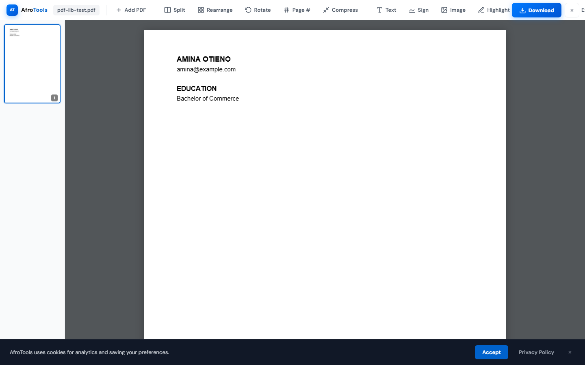
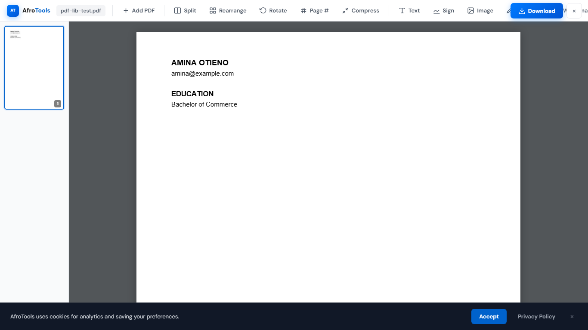
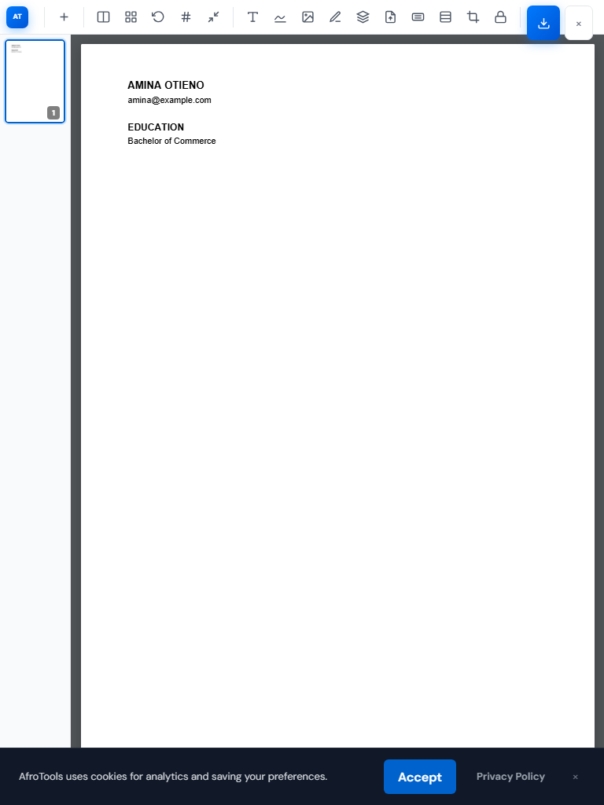
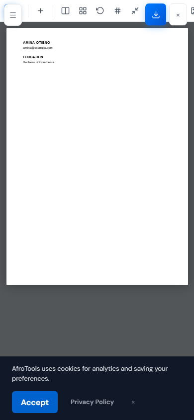
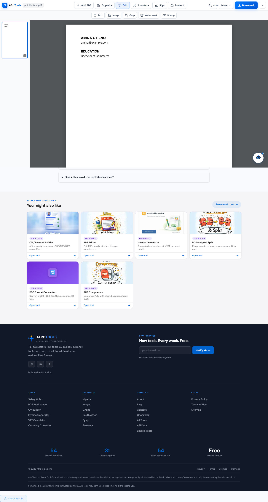
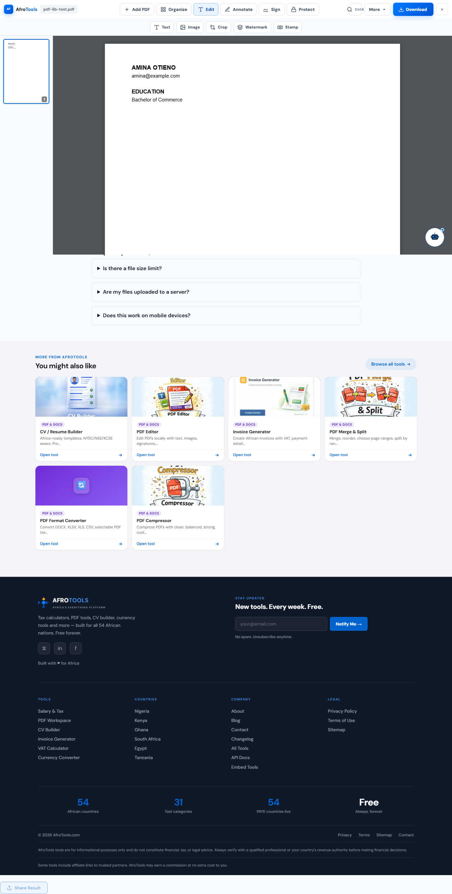
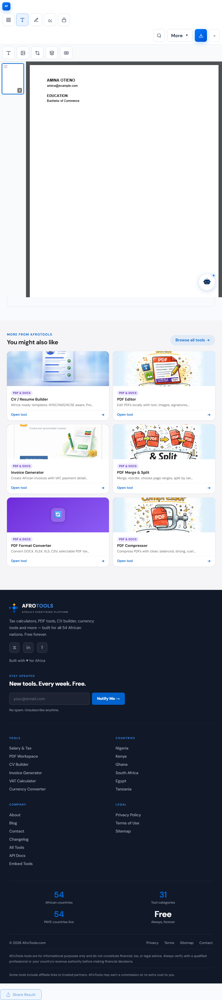
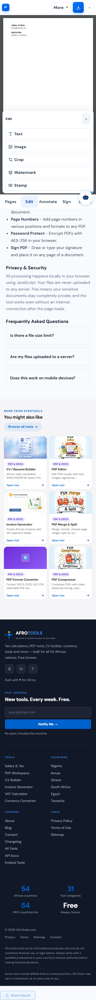
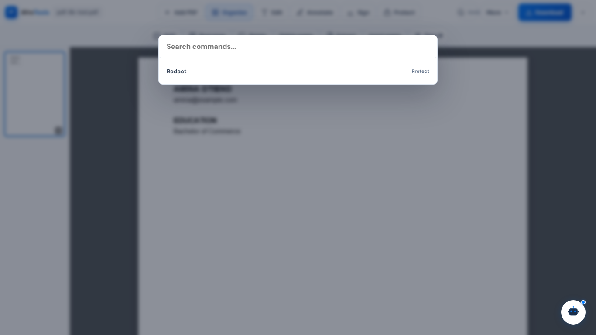

# PDF Workspace Command Bar Responsive Audit

Date: 2026-05-21

## Scope

Target route: `/tools/pdf-workspace/`

Primary changed source file:
- `tools/pdf-workspace/index.html`

Evidence files:
- `audit-results/pdf-workspace-command-bar-responsive/smoke-results.json`
- `audit-results/pdf-workspace-command-bar-responsive/before-desktop-1440.png`
- `audit-results/pdf-workspace-command-bar-responsive/before-laptop-1366.png`
- `audit-results/pdf-workspace-command-bar-responsive/before-tablet-768.png`
- `audit-results/pdf-workspace-command-bar-responsive/before-mobile-390.png`
- `audit-results/pdf-workspace-command-bar-responsive/after-desktop-1440.png`
- `audit-results/pdf-workspace-command-bar-responsive/after-laptop-1366.png`
- `audit-results/pdf-workspace-command-bar-responsive/after-tablet-768.png`
- `audit-results/pdf-workspace-command-bar-responsive/after-mobile-390.png`
- `audit-results/pdf-workspace-command-bar-responsive/after-command-palette.png`

`npm run build` was run as requested and produced broad generated/cachebust churn across the already-dirty checkout. The intentional product/source change for this PR is the PDF Workspace command-bar work above.

## What Changed

- Replaced the long flat toolbar with a responsive command bar.
- Added top-level mode groups: Organize, Edit, Annotate, Forms & Sign, Protect, and Export.
- Added contextual secondary tool rows/sheets per active mode.
- Added a More menu for File, Optimize/Export, View, Protect, and queued/planned commands.
- Added command palette support via Ctrl+K, Cmd+K, and slash when the workspace is open and focus is not inside text input.
- Kept Download as the prominent primary action on desktop, tablet, and mobile.
- Added mobile bottom mode bar: Pages, Edit, Annotate, Sign, Export.
- Kept all existing engine-backed actions reachable from either a mode panel, primary button, or More menu.

## Before Screenshots

## After Screenshots

## Responsive Results

| Viewport | Result |
| --- | --- |
| Desktop 1440x900 | Pass. Logo/file name, Add PDF, modes, More, and Download are visible. No horizontal overflow. |
| Laptop 1366x768 | Pass. Toolbar fits without horizontal overflow. Download remains prominent. |
| Tablet 768x1024 | Pass. Mode controls collapse to compact grouped buttons, More remains reachable, contextual tools wrap instead of forcing page overflow. |
| Mobile 390x844 | Pass. Top bar is compact, Download remains visible, More remains available, and bottom mode bar opens bottom sheets. |

Smoke metrics from the final post-build run:

| Viewport | Body scroll width | Overflow | Console/page errors | Debug/inspector text |
| --- | ---: | --- | --- | --- |
| 1440x900 | 1440 | No | 0 | No |
| 1366x768 | 1366 | No | 0 | No |
| 768x1024 | 768 | No | 0 | No |
| 390x844 | 390 | No | 0 | No |

## Commands Moved Into More

- File: Add PDF, Download, Save to Vault, New workspace, Clear workspace.
- Optimize/Export: Compress, Print, Export images, PDF to images.
- View: Zoom out, Fit width, Zoom in.
- Protect: Redact, Protect/encrypt.
- Queued/planned commands: Draw, Comment/note, Shape, Arrow, Remove password, Flatten annotations.

## Known Limitations

- This PR did not rebuild the PDF engine. Existing engine-backed behavior is preserved.
- Text editing remains overlay/additive behavior from the existing engine; this work does not add true in-place PDF text editing.
- Draw, Comment/note, Shape, Arrow, Fill text field, Checkbox, Initials, Date, Remove password, Flatten annotations, Export images, and PDF to images are surfaced as planned/disabled commands where the current engine does not support them.
- Hardware-keyboard command search works on mobile via slash/Ctrl+K, but the visible search icon is intentionally hidden on small screens to keep the top bar compact.

## Validation

- `git diff --check`: pass before and after build.
- `npm test`: pass.
- `npm run build`: pass.
- Browser smoke on `/tools/pdf-workspace/`: pass.
- Desktop smoke at `1440x900`: pass.
- Laptop smoke at `1366x768`: pass.
- Tablet smoke at `768x1024`: pass.
- Mobile smoke at `390x844`: pass.
- Console error check: pass, no console/page errors in final smoke.
- Horizontal overflow check: pass, no viewport exceeded body scroll width.
