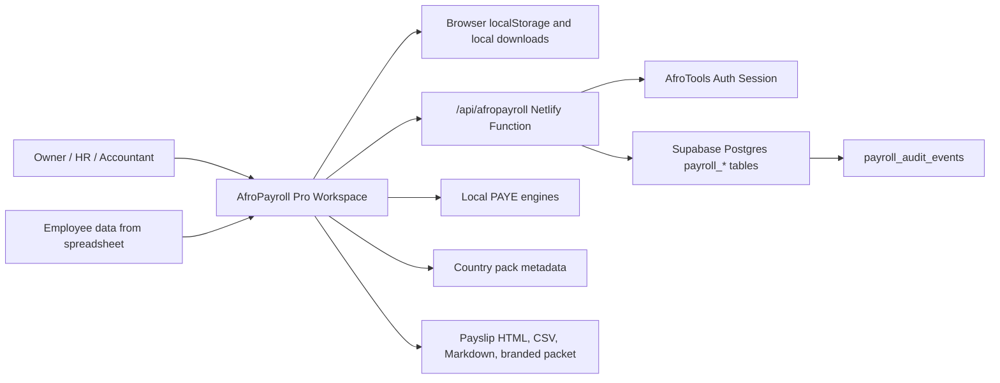
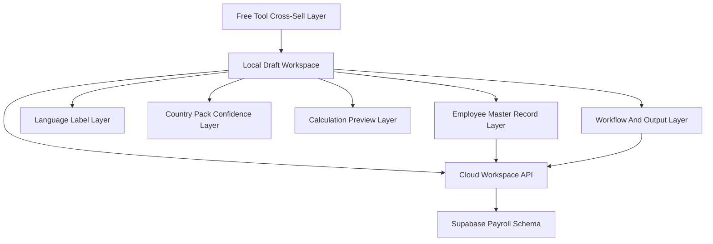
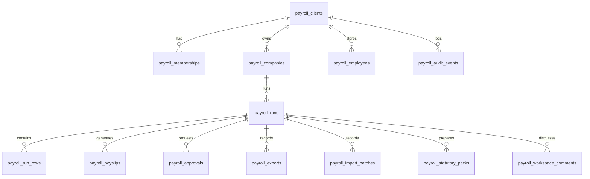
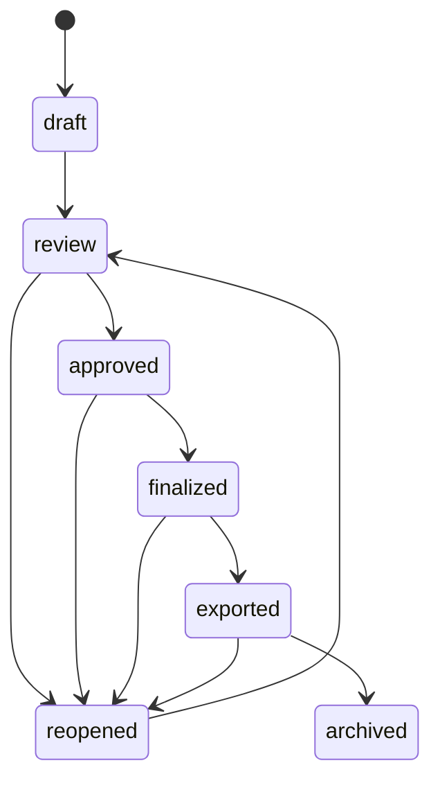

# AfroPayroll Pro Architecture

Created: 2026-05-02

## Purpose

AfroPayroll Pro is an Africa-first payroll workspace for small employers, accountants, HR/admin officers, NGOs, schools, clinics, and diaspora operators. The architecture must support a real SaaS workflow without pretending to be a statutory filing, remittance, or salary disbursement system.

The product should feel like affordable payroll operations software:

- Capture a monthly payroll run.
- Reuse company and employee data.
- Import rows from spreadsheets.
- Generate payslips and branded handoff packets.
- Prepare country-specific statutory pack drafts.
- Keep approvals, roles, exports, and audit history.
- Keep every compliance claim honest by country pack status.

## Front-Facing Language Rules

Payroll Pro screens should describe customer jobs, product state, and review boundaries. Do not expose implementation names in customer-facing UI unless the page is explicitly internal.

| Internal wording | Customer-facing wording |
| --- | --- |
| Supabase actions | Payroll run actions |
| Sync current draft | Save run to account |
| Account-backed runs | Saved payroll runs |
| Local work | Saved on this device |
| Cloud run history | Account run history |
| Cloud audit | Approval history or audit records |
| Token route | Secure invite link |
| Statutory pack CSV | Statutory review pack |
| Compliance pack | Statutory review pack |
| Payment export | Payment/accounting handoff |

Use the job sequence customers expect from payroll products: set up company, add employees, import payroll, review payroll, approve run, generate payslips, prepare statutory review pack, and export payment or accounting handoff. Keep guardrails explicit: AfroPayroll can prepare review packs, payment-file drafts, payslip records, approvals, and audit history, but it must not claim statutory filing, salary disbursement, remittance, bank transfer, WhatsApp API delivery, or certified compliance unless those actions are implemented and verified.

Customer-facing Payroll Pro copy belongs in `assets/js/lib/afropayroll-language-packs.js`. Repeated and dynamic strings should use `data-ap-lang-key`, `t(...)`, `cloudText(...)`, or `proText(...)` rather than inline English-only label objects in the workspace or dashboard. English, French, and Swahili labels must stay key-complete across the full label union; `npm run pro:verify` checks language-pack coverage and front-facing internal wording leakage. Keep official payroll acronyms such as PAYE, NSSF, SSNIT, UIF, SDL, and VAT unchanged, and leave country names and currencies supplied by country-pack data as data values rather than translated copy.

## First-Run Setup Flow

Payroll Pro should start with company setup before monthly payroll rows. A new employer, business owner, or accountant should understand the first action without touching the payroll table.

Setup captures:

- Employer or client name.
- Country and currency.
- Payroll contact and reviewer or approver email.
- Pay frequency: monthly, weekly, biweekly, or fortnightly.
- Default pay day.
- Default department or cost center.
- Default language lane.
- Working days per month.
- Employer contribution assumption: use country-pack preview where available, review manually before handoff, or not set.

Setup completion is scored from six customer-facing checks:

- Company profile complete.
- Pay schedule selected.
- Country pack selected.
- Reviewer/contact set.
- Employees added.
- Payment details ready.

Persistence:

- Unsigned users save setup to browser localStorage and the UI must call it "Saved on this device".
- Signed-in users save setup through `/api/afropayroll` using the existing `save_client` action. The API stores setup defaults in `payroll_clients.settings` and `payroll_companies.payroll_settings`.
- Monthly runs still use the existing `save_run` action. Setup defaults are copied into the run payload through the existing client metadata path.

Guardrails:

- Setup defaults can prepare a run header, employee defaults, review prompts, and handoff files.
- Setup does not file statutory returns, move salary money, remit deductions, submit bank files, or certify compliance.
- Keep setup and monthly run state separate in the UI: setup creates the company/client context; the run table remains the monthly payroll workspace.

## Source Of Truth Files

| Concern | Current source |
| --- | --- |
| Workspace UI | `tools/afropayroll-os/workspace.html` |
| Country pack data | `data/hr/afropayroll-country-packs.js` |
| Country pack helper | `assets/js/lib/afropayroll-country-packs.js` |
| Language labels | `assets/js/lib/afropayroll-language-packs.js` |
| Import mapper | `assets/js/lib/afropayroll-import-mapper.js` |
| Pro architecture contract | `assets/js/lib/afropayroll-pro-architecture.js` |
| Cloud API | `netlify/functions/api-afropayroll.js` |
| Database schema | `supabase/migrations/033-afropayroll-pro-schema.sql` |
| RLS helper hardening | `supabase/migrations/034-afropayroll-pro-rls-helper-hardening.sql` |
| FK indexes | `supabase/migrations/035-afropayroll-pro-fk-indexes.sql` |
| Architecture verifier | `scripts/verify-afropayroll-pro-architecture.js` |

## System Context



## Layered Architecture



### Local Draft Workspace

Responsibility:

- Company header.
- Local employee master records.
- Pay period and pay date.
- Row-level employee payroll inputs.
- Local calculations and warnings.
- Local saved run history.
- Local downloads.

Persistence:

- Browser localStorage until the user signs in and explicitly saves setup or a payroll run to the account.

Hard rule:

- Local salary data must never be described as cloud-saved.

### Employee Master Record Layer

Responsibility:

- Store reusable employee code, full name, preferred name, email, phone, country, currency, department, role or job title, employment type, pay schedule, hire date, active/inactive status, tax ID, pension/social security ID, bank or mobile-money route, and payslip delivery email.
- Let payroll rows link to a master employee record instead of retyping identity and operations fields every month.
- Score readiness with customer-facing badges: ready, missing payment route, missing statutory ID, missing payslip contact, not linked to current run, and inactive.
- Warn before review, approval, payslip, statutory review pack, and handoff export when a payroll row has no linked employee record or the linked record is missing payroll operations details.
- Let users add an employee to the current payroll run, update a linked payroll row from the employee record, and mark an employee inactive without deleting payroll history.
- Import and export employee roster rows for low-bandwidth payroll admin work.

Persistence:

- Browser localStorage first.
- Supabase `payroll_employees` when a signed-in user explicitly saves an employee record through `/api/afropayroll?action=save_employee` or saves a payroll run to the account through the existing `save_run` path.
- The Pro dashboard uses account employee records returned by the `dashboard` action when available, and falls back to records saved on this device when no account employee master is loaded.

Hard rule:

- Employee bank, mobile-money, tax, pension, and social-security identifiers are payroll operations data. They do not prove payment, filing, employee confirmation, or compliance.
- No employee master data is exposed directly from the browser with a service-role key. The Netlify function checks owner or active membership roles before listing or saving employee records.

### Import Mapper Layer

Responsibility:

- Support four browser-side import templates: employee master records, payroll run rows, payment details update, and statutory IDs update.
- Parse CSV, TSV, TXT, and browser-parsed Excel files without uploading the raw source file.
- Detect common spreadsheet columns for employee code, name, email, phone, country, currency, department, role, gross pay, allowances, overtime, unpaid days, deductions, statutory IDs, and bank or mobile-money routes.
- Validate imports with blocking errors, warnings, auto-fixed values, ignored columns, duplicate employee rows, and duplicate payroll rows.
- Preview valid, warning, and error rows before apply, including counts by country and currency.
- Apply valid rows only. Error rows must remain in the report and must not silently modify employee or payroll state.
- Download sample CSV templates and error report CSVs.
- Keep a local undo snapshot for the last applied import.

Persistence:

- File contents stay in the browser during mapping and preview.
- The raw spreadsheet or CSV file is not uploaded to Supabase.
- If the user is signed in and the run is already saved to the account, `/api/afropayroll?action=record_import` stores import metadata only: template/import type, source filename, MIME type, applied row count, error count, warning count, sanitized mapping, and sanitized error summaries.

Hard rule:

- Excel support depends on the browser loading the SheetJS parser. If the parser cannot load, the UI must ask the user to save the sheet as CSV or TSV and import again.

### Country Pack Confidence Layer

Responsibility:

- Country support level.
- Currency.
- Language lanes.
- Supported deductions.
- Source links.
- Verification and next-review dates.
- Display warnings.

Hard rule:

- `full_pack` means workspace preview support. It does not mean filing-ready.

### Calculation Preview Layer

Responsibility:

- Use local engines for launch countries where available.
- Fall back to arithmetic preview for estimate or next-pack rows.
- Attach calculation mode and warning text to each row.

Launch engines:

- Nigeria: `assets/js/engines/ng-paye.js`
- Kenya: `assets/js/engines/ke-paye.js`
- Ghana: `assets/js/engines/gh-paye.js`
- South Africa: `assets/js/engines/za-paye.js`

Hard rule:

- Every engine result is still a preview until country statutory pack review is complete.

### Statutory Review Packs

AfroPayroll prepares review packs for the four launch full-pack countries: Nigeria, Kenya, Ghana, and South Africa. The workspace renders country-specific checklist items, report names, due prompts, official source links, source review dates, next review dates, confidence levels, aggregate payroll totals, readiness gates, and reviewer sign-off fields.

The pack outputs are:

- Statutory review CSV for accountant handoff and spreadsheet review.
- Statutory review Markdown note for client or reviewer comments.
- Printable HTML review view for internal sign-off.
- Account-saved statutory pack records through `generate_statutory_packs` for synced runs.

Country-pack metadata in `data/hr/afropayroll-country-packs.js` remains the statutory source of truth. Do not restamp verification dates, change effective dates, or add statutory rates without checking official sources first. South Africa must keep the SARS year-sync warning visible until the current SARS year is actively reviewed against the calculation engine.

### Country Pack Review Workflow

Country-pack support is maintained through the Pro-gated, noindex support console at `/tools/afropayroll-os/support`. The console is read-only and exposes operational review states, not admin mutation controls.

Review states:

- `current`: source review is inside the review window.
- `review_due_soon`: source review is due within 45 days.
- `review_overdue`: source review date has passed.
- `source_changed`: source movement has been flagged and official source review is required.
- `engine_sync_needed`: country-pack facts and local calculation engine need sync review.
- `next_pack_candidate`: metadata is promising, but full-pack status is not yet approved.

Support console sections:

- Launch country health.
- Estimate country queue.
- Next-pack queue.
- Overdue source reviews.
- Engine availability.
- Statutory calendar coverage.
- Reviewer checklist.

Exports:

- Country pack health JSON.
- Country pack review CSV.
- Next review queue CSV.

The future-agent runbook lives in `docs/AFROPAYROLL-PRO-COUNTRY-PACK-REVIEW.md`.

Readiness gates must stay honest:

- Missing tax IDs.
- Missing pension, social security, UIF, NSSF, SSNIT, or equivalent IDs.
- Missing payment route data.
- Estimate-mode or next-pack country selected.
- Source review due.
- Calculation engine unavailable for a full-pack country.

Review packs never mean official filing, statutory remittance, salary payment, bank transfer, or certified compliance.

### AfroTax Import Review Contract

AfroTax may read `afropayroll_pro_saved_runs` and `afropayroll_pro_workspace_preview` when the user manually chooses Import review data inside AfroTax. The handoff is review metadata only:

- Payroll saved run or workspace preview.
- Source period.
- Currency.
- Payroll row count.
- Payroll warnings.
- Payslip/export record count where available.
- Statutory review pack count where available.
- PAYE/payroll tax and social security/pension evidence draft totals.

This contract does not mean automatic sync. It does not prove payroll filing, salary payment, tax remittance, or certified compliance.

### Payment And Accounting Handoff

AfroPayroll prepares handoff files that reduce monthly payroll administration, but it does not move money, submit bank files, connect to mobile-money operators, or post journals to accounting platforms.

Payment readiness checks:

- Linked employee payment route is present.
- Bank or mobile-money reference is present.
- Currency is known.
- Net pay is positive.
- Country pack is known and not `needs_verification`.
- Employee code is present.
- Estimate-only rows remain visible as review risks.

Payment file draft outputs:

- Generic bank upload draft CSV for bank handoff review. It is not a verified bank-specific format.
- Generic mobile-money handoff CSV for wallet or mobile-money operator review. AfroPayroll does not send mobile-money API payments.
- Country/currency grouped payment CSV for multi-country runs.
- Payment exceptions CSV for rows blocked by missing route, missing provider, missing account/mobile number, missing currency, non-positive net pay, currency mismatch, duplicate payment reference, or missing employee code.
- Payment review checklist CSV for sign-off before external bank or wallet upload.
- Payment handoff Markdown note with country/currency group totals and review warnings.

The payment profile selector in `tools/afropayroll-os/workspace.html` supports:

- Generic bank CSV.
- Generic mobile-money CSV.
- Country/currency grouped CSV.
- Exception report.
- Review checklist.

Each profile carries employee code, employee name, country, currency, net pay, payment route type, provider/bank name, account/mobile number, narration/reference, and review status. The browser preview masks account/mobile values; the local CSV draft contains the value entered by the payroll operator. Raw payment files are not uploaded by the profile export flow.

Accounting outputs:

- Editable chart-of-accounts mapping for salary expense, allowance expense, overtime expense, employer contribution expense, tax payable liability, pension/social security payable liability, net salary payable liability, and department/cost center tracking.
- Default local profiles: Simple small business, Accountant handoff, and Department summary. These are starting points only; AfroPayroll must not invent a customer's chart of accounts.
- Import-ready CSV drafts for generic journals, Xero-style CSV labels, QuickBooks-style CSV labels, and Sage-style CSV labels. These are label templates for accountant review, not direct integrations or certified vendor formats.
- Journal lines for salary, allowances, overtime, employer contribution expense, tax payable, pension/social security payable, employer contribution payable, and net salary payable.
- Preview totals for debit, credit, imbalance, line count, currencies, and department/cost-center gaps before download.
- Department or cost center, currency, country, run period, employee code, and payee name are carried through where available.

The accounting mapping profile is saved locally in the workspace draft. No schema was added for cloud accounting profiles in this pass. Synced runs record accounting exports through `record_export` using metadata only: profile key/name, export format, row count, debit total, credit total, imbalance, currencies, and explicit markers that no journal was posted and no accounting API sync occurred.

Payment export records continue to store metadata only: profile key/name, row count, exception count, currencies, and explicit markers that no funds were moved, no bank integration was used, and no mobile-money API sending occurred. Export records must not include raw bank account or mobile-money numbers beyond the explicit synced payroll save path.

Hard wording:

- Use "payment file draft", "bank upload draft", "mobile-money handoff", "accounting handoff", and "import-ready CSV".
- Always include "Review before uploading to your bank or wallet provider" and "AfroPayroll does not transfer salaries" in user-facing handoff surfaces.
- Do not claim bank-specific formats, direct bank integration, mobile-money API sending, provider delivery, payment confirmation, salary transfer, accounting posting, or direct Xero/QuickBooks/Sage sync unless a future integration is verified from current official provider documentation.

### Cloud Workspace API

Responsibility:

- Verify user session.
- Use service-role Supabase access only after application RBAC checks.
- Save and load payroll runs.
- Generate synced output records.
- Record approvals, imports, exports, invites, and audit events.

Current endpoint:

- `/api/afropayroll`

Hard rule:

- The Netlify function uses a privileged key, so the function itself must enforce role access before every read or write.

### Supabase Payroll Schema

Responsibility:

- Tenant workspaces.
- Role permissions.
- Companies and payroll rows.
- Approvals.
- Payslips.
- Statutory pack drafts.
- Imports and exports.
- Audit history.

Key tables:

- `payroll_clients`
- `payroll_memberships`
- `payroll_role_permissions`
- `payroll_companies`
- `payroll_employees`
- `payroll_runs`
- `payroll_run_rows`
- `payroll_payslips`
- `payroll_approvals`
- `payroll_import_batches`
- `payroll_exports`
- `payroll_statutory_packs`
- `payroll_audit_events`
- `payroll_run_dashboard`

Hard rule:

- Salary-sensitive rows remain protected by RLS and API role gates.

### Workflow And Output Layer

Responsibility:

- CSV import.
- Payslip packet generation.
- Statutory pack draft generation.
- Branded packet generation.
- Approval workflow.
- Export record creation.
- Dashboard state.
- Audit trail.

Hard rule:

- Generated outputs are review packets. They do not file, remit, or move funds.

### Growth Connector Layer

Responsibility:

- Link free payroll-adjacent tools into AfroPayroll Pro.
- Keep free calculators usable.
- Move high-intent users from single calculations into monthly payroll workflow.

Initial feeder tools:

- `tools/payslip-generator/`
- `tools/staff-cost/`
- `tools/minimum-wage/`
- `tools/leave-calculator/`
- `tools/social-security/`

Hard rule:

- Do not break or gate free calculations.

## Data Model Map



## Role Model

| Role | View salary | Edit payroll | Approve runs | Manage members | First use case |
| --- | --- | --- | --- | --- | --- |
| `owner` | Yes | Yes | Yes | Yes | Business owner |
| `admin` | Yes | Yes | Yes | Yes | Operations manager |
| `payroll_admin` | Yes | Yes | No | No | HR/admin officer |
| `accountant` | Yes | Yes | Yes | No | External accountant |
| `approver` | Yes | No | Yes | No | Client approver |
| `viewer` | No | No | No | No | Metadata-only stakeholder |

Role groups in `assets/js/lib/afropayroll-pro-architecture.js` must stay aligned with `netlify/functions/api-afropayroll.js` and the seed rows in `033-afropayroll-pro-schema.sql`.

## Workflow States



State intent:

- `draft`: work in progress.
- `review`: client, accountant, or approver review has been requested.
- `approved`: approved by an approval-capable role.
- `finalized`: approved run is locked for handoff preparation.
- `exported`: a finalized run has a recorded handoff export and remains locked.
- `reopened`: corrections have been requested with a reason, and row edits are allowed again.
- `archived`: historical record only.

## Close Room Workflow

The workspace Close Room is the front-facing approval and month-close surface for a selected run. It shows current run status, approval status, reviewer, last action, checklist readiness, reviewer comments, and recent audit events. It must describe payroll review work, not legal certification.

Close checklist items:

- Employee records complete.
- Payment routes complete.
- Statutory IDs complete.
- Country packs reviewed.
- Warnings resolved or accepted.
- Variance reviewed.
- Payslips generated.
- Statutory review pack generated.
- Payment/accounting handoff exported.

Persistence rules:

- Signed-out users can move local runs through the visible workflow, but comments and state are saved on this device only.
- Synced runs use existing `payroll_approvals`, `payroll_workspace_comments`, and `payroll_audit_events`.
- `approve_run` and `finalize_run` require an approval note.
- `request_changes` and `reopen_run` require a reason.
- Approved, finalized, and exported runs are locked for row edits until reopened.
- `record_export` records handoff metadata only. It does not move money, submit statutory filings, or certify compliance.

## Reminder Center

The workspace Reminder Center is the front-facing action list before payroll close. It reuses real workspace state rather than marketing prompts: linked employee readiness, run lifecycle status, variance acknowledgement, statutory review pack counts, payment/accounting handoff counts, country source review dates, and whether the current draft is saved only on this device.

Reminder types currently generated:

- Missing payment route.
- Missing statutory ID.
- Missing payslip contact.
- Approval pending.
- Variance not reviewed.
- Statutory review pack missing.
- Payment handoff missing.
- Accounting journal not exported.
- Country source review due.
- Local draft not saved to account.

Reminder behavior:

- Filters support all reminders, client/company, country, severity, and due date buckets for overdue, due soon, and due this month.
- Action buttons scroll to the relevant workspace area: employee records, current run rows, Close Room, statutory review pack, payment handoff, accounting mapping, or account save.
- Acknowledgements are saved locally in `localStorage` under `afropayroll_pro_reminder_acknowledgements`. They do not imply reviewer approval, statutory filing, payment completion, or account-wide dismissal.
- No email, SMS, WhatsApp, or external notification is sent by this feature.
- The Pro dashboard summarizes the same states as Ready, Needs action, Approval pending, Export pending, and overall readiness.

## Recurring Monthly Runs

AfroPayroll supports a monthly repeat workflow so an operator does not rebuild payroll from zero. The front-facing action is **Start from previous run**.

Clone behavior:

- The user chooses a previous local or account-saved run, a new pay period, and a new pay date.
- Active payroll rows, linked employee references, recurring pay values, department/role/country/currency, and reusable employee records are copied into a new draft run.
- Approval, finalization, export state, approval comments, payslip counts, statutory pack counts, and export counts are reset.
- The historical source run is not edited.
- Local clones create a new device draft id and do not overwrite a saved run unless the user confirms the period/company collision.
- Account clones use `clone_run`, save a new draft run, and write a `clone_run` audit event.
- If the source run is exported and the target period is the same period, the UI requires confirmation and the API requires `allow_same_period`.

Variance review:

- The clone stores a previous-run snapshot for comparison.
- The workspace compares previous versus current rows for gross changed, net changed, new employee, missing employee, country/currency changed, deductions changed, allowances/overtime changed, and payment route missing.
- Summary metrics show total gross difference, total net difference, employee count difference, and warning count.
- A cloned run cannot be approved until variance review is acknowledged.
- Account-saved variance acknowledgement uses `acknowledge_variance` and writes an audit event.

## API Contract

All actions use `/api/afropayroll`.

## Role Boundaries

Customer-facing labels should stay simple: Owner, Admin, Payroll admin, Accountant, Approver, and Viewer. Internal group names such as `editPayroll` and `approvePayroll` are architecture/API terms and should not appear in customer-facing UI.

The live Supabase helper functions inspected on 2026-05-09 are:

- `private.payroll_can_access`: any active payroll role can read client/company metadata.
- `private.payroll_can_view_payroll`: Owner, Admin, Payroll admin, Accountant, and Approver can read salary-sensitive payroll tables.
- `private.payroll_can_edit_payroll`: Owner, Admin, Payroll admin, and Accountant can edit employee/run/output data.
- `private.payroll_can_approve`: Owner, Admin, Accountant, and Approver can approve, finalize, or reopen runs.
- `private.payroll_can_manage_client`: Owner and Admin can manage members/client administration.

The API uses the same boundaries because it writes with a service-role key and must enforce application RBAC before every salary-sensitive action.

| Capability | Owner | Admin | Payroll admin | Accountant | Approver | Viewer |
| --- | --- | --- | --- | --- | --- | --- |
| View dashboard | Yes | Yes | Yes | Yes | Yes | No salary dashboard |
| View salary rows | Yes | Yes | Yes | Yes | Yes | No |
| Edit employees | Yes | Yes | Yes | Yes | No | No |
| Edit run rows | Yes | Yes | Yes | Yes | No | No |
| Request approval | Yes | Yes | Yes | Yes | No | No |
| Approve/finalize | Yes | Yes | No | Yes | Yes | No |
| Reopen | Yes | Yes | No | Yes | Yes | No |
| Generate payslips | Yes | Yes | Yes | Yes | No | No |
| Generate statutory packs | Yes | Yes | Yes | Yes | No | No |
| Record exports | Yes | Yes | Yes | Yes | No | No |
| Invite members | Yes | Yes | No | No | No | No |
| View audit | Yes | Yes | Yes | Yes | Yes | No |

Viewer is intentionally metadata-only. It can exist in membership/client records, but it must not be accepted by API salary-data endpoints or salary-sensitive RLS helpers. Approver can review salary data and record decisions, but must not edit employees, payroll rows, payslips, statutory packs, or exports. Payroll admin can run payroll but cannot manage members.

| Action | Method | Role group | Main tables | Audit |
| --- | --- | --- | --- | --- |
| `list` | GET | `viewPayroll` | `payroll_run_dashboard` | No |
| `dashboard` | GET | `viewPayroll` | `payroll_run_dashboard`, `payroll_employees` | No |
| `roles` | GET | `viewPayroll` | `payroll_role_permissions`, `payroll_memberships` | No |
| `audit` | GET | `viewPayroll` | `payroll_audit_events` | No |
| `close_room` | GET | `viewPayroll` | `payroll_approvals`, `payroll_workspace_comments`, `payroll_audit_events` | No |
| `load` | GET | `viewPayroll` | `payroll_runs`, `payroll_run_rows`, `payroll_companies`, `payroll_employees` | No |
| `list_employees` | GET | `viewPayroll` | `payroll_employees` | No |
| `save_employee` | POST | `editPayroll` | `payroll_employees` | Yes |
| `record_employee_event` | POST | `editPayroll` | `payroll_audit_events` | Yes |
| `save_run` | POST | `editPayroll` | `payroll_runs`, `payroll_run_rows`, `payroll_companies`, `payroll_employees` | Yes |
| `clone_run` | POST | `editPayroll` | `payroll_runs`, `payroll_run_rows`, `payroll_employees`, `payroll_audit_events` | Yes |
| `acknowledge_variance` | POST | `editPayroll` | `payroll_runs`, `payroll_audit_events` | Yes |
| `submit_run` | POST | `editPayroll` | `payroll_approvals`, `payroll_runs`, `payroll_audit_events` | Yes |
| `request_approval` | POST | `editPayroll` | `payroll_approvals`, `payroll_runs` | Yes |
| `request_changes` | POST | `approvePayroll` | `payroll_approvals`, `payroll_runs`, `payroll_workspace_comments`, `payroll_audit_events` | Yes |
| `approve_run` | POST | `approvePayroll` | `payroll_approvals`, `payroll_runs` | Yes |
| `reject_run` | POST | `approvePayroll` | `payroll_approvals`, `payroll_runs` | Yes |
| `finalize_run` | POST | `approvePayroll` | `payroll_runs`, `payroll_audit_events` | Yes |
| `reopen_run` | POST | `approvePayroll` | `payroll_runs`, `payroll_audit_events` | Yes |
| `add_comment` | POST | `viewPayroll` | `payroll_workspace_comments` | Yes |
| `generate_payslips` | POST | `editPayroll` | `payroll_payslips`, `payroll_run_rows` | Yes |
| `generate_statutory_packs` | POST | `editPayroll` | `payroll_statutory_packs`, `payroll_run_rows` | Yes |
| `record_export` | POST | `editPayroll` | `payroll_exports`, `payroll_runs` | Yes |
| `record_import` | POST | `editPayroll` | `payroll_import_batches` | Yes |
| `invite_member` | POST | `manageMembers` | `payroll_memberships` | Yes |
| `create_employee_portal_invite` | POST | `editPayroll` | `payroll_employee_portal_invites`, `payroll_audit_events` | Yes |
| `employee_portal` | GET | Secure invite token | `payroll_employee_portal_invites`, `payroll_employees`, `payroll_payslips` | No |
| `employee_confirm_profile` | POST | Secure invite token | `payroll_employee_portal_invites`, `payroll_employees` | Yes |
| `employee_portal_audit` | POST | Secure invite token | `payroll_employee_portal_invites`, `payroll_audit_events` | Yes |
| `delete` | DELETE | `editPayroll` | `payroll_runs` | Yes |

## Readiness Gates

| Gate | Meaning |
| --- | --- |
| `local_only` | Works without login and must keep salary data in the browser. |
| `account_required` | Requires AfroTools auth but not necessarily a synced run. |
| `synced_run_required` | Requires a saved cloud run id before audit, roles, approvals, or output metadata can be written. |
| `full_pack_recommended` | Country should be `full_pack` for stronger preview confidence. |
| `human_review_required` | Output can be prepared, but final filing or client sign-off needs qualified review. |

## Agent Ownership Map

Use this when splitting programmer agents.

| Agent lane | Owns | Must not touch |
| --- | --- | --- |
| Country packs | `data/hr/afropayroll-country-packs.js`, country source notes | Workspace rebuilds, Supabase schema |
| Language packs | `assets/js/lib/afropayroll-language-packs.js` | Country facts, statutory claims |
| Workspace UX | `tools/afropayroll-os/workspace.html` | Live DB migrations unless explicitly assigned |
| Cloud API | `netlify/functions/api-afropayroll.js` | Static calculator pages |
| Supabase schema | `supabase/migrations/033*`, `034*`, `035*` and follow-on migrations | Browser UI |
| Output design | Payslip, branded packet, statutory CSV/PDF logic | Role model and RLS |
| QA architecture | `scripts/verify-afropayroll-pro-architecture.js`, narrow smoke scripts | Feature implementation |

## Next Architecture Build Order

1. Split the workspace monolith into small helpers:
   - run model and row normalization
   - employee master record normalization and import parser
   - calculation adapter
   - import parser
   - export packet builder
   - cloud sync client
2. Promote payslip HTML to branded PDF-grade output after the current HTML/print-view portal packet is accountant-reviewed.
3. Add signed-in company and employee profile screens beyond the workspace roster.
4. Add recurring monthly run cloning from a previous run.
5. Add deeper pack PDF styling after accountant review of the CSV, Markdown, and HTML review outputs.
6. Add role-specific UI states that hide unsafe actions instead of only letting the API reject them.
7. Add a browser smoke path for import, calculate, save, reload, export, and approval.

## Verification

Run these after changing architecture, API actions, roles, migrations, or workspace wiring:

```bash
node --check assets/js/lib/afropayroll-pro-architecture.js
node --check netlify/functions/api-afropayroll.js
node scripts/verify-afropayroll-pro-architecture.js
npm run pro:verify
npm run audit
```

`npm run pro:verify` intentionally runs both the general Pro app registry verifier and the AfroPayroll-specific verifier. The AfroPayroll verifier must protect required payroll routes, Pro gates, token-gated employee portal behavior, customer-facing wording guardrails, current API action coverage, required workspace sections, NG/KE/GH/ZA statutory metadata, import mapper templates, duplicate country-pack file detection, and browser-side service-role secret leakage checks.

Current known limitations:

- No live signed-in Supabase test user is committed to the repo. Live save/load/RLS/audit testing must use a safe external test account and must not insert production client payroll data.
- Employee portal v1 is a secure invite-link surface for one assigned employee and run. It supports safe no-token, invalid, expired, already-confirmed, no-payslip, and loaded states; payslip detail view; HTML download; print view; profile confirmation with a short employee note; confirmation history; and token-scoped audit events for portal load, confirmation, payslip view, download, and print. It does not let employees browse other employees, other runs, or workspace records.
- Payment and accounting outputs are handoff drafts only. AfroPayroll does not move funds, submit bank/mobile-money files, or post to accounting APIs.
- Country-pack metadata is static repo data. Rates, source dates, and South Africa SARS year sync need scheduled expert review before paid reliance.
- The language layer has EN/FR/SW key-complete coverage for the current Payroll Pro setup, employee, import, close, reminder center, recurring, statutory review, payment handoff, accounting handoff, portal, and support labels. New strings must be added to all three languages before release.

For a release path, add the wider release checks from `docs/release-checklist.md`.
