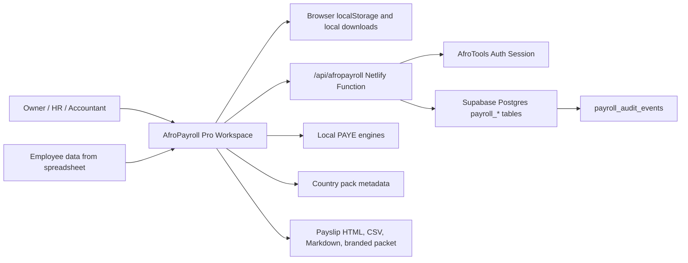
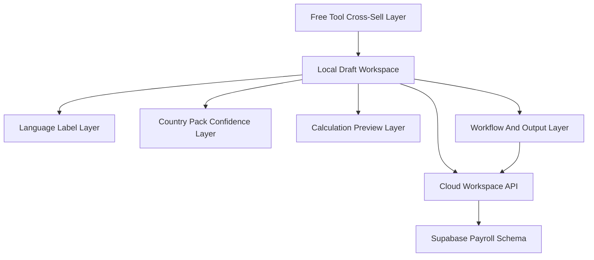
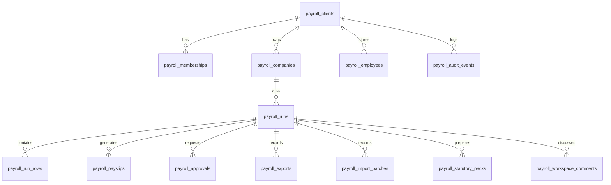
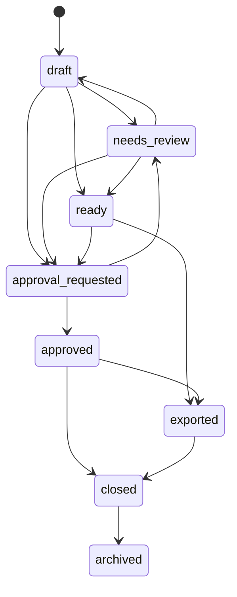

# AfroPayroll Pro Architecture

Created: 2026-05-02

## Purpose

AfroPayroll Pro is an Africa-first payroll workspace for small employers, accountants, HR/admin officers, NGOs, schools, clinics, and diaspora operators. The architecture must support a real SaaS workflow without pretending to be a statutory filing, remittance, or salary disbursement system.

The product should feel like affordable payroll operations software:

- Capture a monthly payroll run.
- Reuse company and employee data.
- Import rows from spreadsheets.
- Generate payslips and branded handoff packets.
- Prepare country-specific statutory pack drafts.
- Keep approvals, roles, exports, and audit history.
- Keep every compliance claim honest by country pack status.

## Source Of Truth Files

| Concern | Current source |
| --- | --- |
| Workspace UI | `tools/afropayroll-os/workspace.html` |
| Country pack data | `data/hr/afropayroll-country-packs.js` |
| Country pack helper | `assets/js/lib/afropayroll-country-packs.js` |
| Language labels | `assets/js/lib/afropayroll-language-packs.js` |
| Pro architecture contract | `assets/js/lib/afropayroll-pro-architecture.js` |
| Cloud API | `netlify/functions/api-afropayroll.js` |
| Database schema | `supabase/migrations/033-afropayroll-pro-schema.sql` |
| RLS helper hardening | `supabase/migrations/034-afropayroll-pro-rls-helper-hardening.sql` |
| FK indexes | `supabase/migrations/035-afropayroll-pro-fk-indexes.sql` |
| Architecture verifier | `scripts/verify-afropayroll-pro-architecture.js` |

## System Context



## Layered Architecture



### Local Draft Workspace

Responsibility:

- Company header.
- Pay period and pay date.
- Row-level employee payroll inputs.
- Local calculations and warnings.
- Local saved run history.
- Local downloads.

Persistence:

- Browser localStorage until the user signs in and syncs.

Hard rule:

- Local salary data must never be described as cloud-saved.

### Country Pack Confidence Layer

Responsibility:

- Country support level.
- Currency.
- Language lanes.
- Supported deductions.
- Source links.
- Verification and next-review dates.
- Display warnings.

Hard rule:

- `full_pack` means workspace preview support. It does not mean filing-ready.

### Calculation Preview Layer

Responsibility:

- Use local engines for launch countries where available.
- Fall back to arithmetic preview for estimate or next-pack rows.
- Attach calculation mode and warning text to each row.

Launch engines:

- Nigeria: `assets/js/engines/ng-paye.js`
- Kenya: `assets/js/engines/ke-paye.js`
- Ghana: `assets/js/engines/gh-paye.js`
- South Africa: `assets/js/engines/za-paye.js`

Hard rule:

- Every engine result is still a preview until country statutory pack review is complete.

### Cloud Workspace API

Responsibility:

- Verify user session.
- Use service-role Supabase access only after application RBAC checks.
- Save and load payroll runs.
- Generate synced output records.
- Record approvals, imports, exports, invites, and audit events.

Current endpoint:

- `/api/afropayroll`

Hard rule:

- The Netlify function uses a privileged key, so the function itself must enforce role access before every read or write.

### Supabase Payroll Schema

Responsibility:

- Tenant workspaces.
- Role permissions.
- Companies and payroll rows.
- Approvals.
- Payslips.
- Statutory pack drafts.
- Imports and exports.
- Audit history.

Key tables:

- `payroll_clients`
- `payroll_memberships`
- `payroll_role_permissions`
- `payroll_companies`
- `payroll_employees`
- `payroll_runs`
- `payroll_run_rows`
- `payroll_payslips`
- `payroll_approvals`
- `payroll_import_batches`
- `payroll_exports`
- `payroll_statutory_packs`
- `payroll_audit_events`
- `payroll_run_dashboard`

Hard rule:

- Salary-sensitive rows remain protected by RLS and API role gates.

### Workflow And Output Layer

Responsibility:

- CSV import.
- Payslip packet generation.
- Statutory pack draft generation.
- Branded packet generation.
- Approval workflow.
- Export record creation.
- Dashboard state.
- Audit trail.

Hard rule:

- Generated outputs are review packets. They do not file, remit, or move funds.

### Growth Connector Layer

Responsibility:

- Link free payroll-adjacent tools into AfroPayroll Pro.
- Keep free calculators usable.
- Move high-intent users from single calculations into monthly payroll workflow.

Initial feeder tools:

- `tools/payslip-generator/`
- `tools/staff-cost/`
- `tools/minimum-wage/`
- `tools/leave-calculator/`
- `tools/social-security/`

Hard rule:

- Do not break or gate free calculations.

## Data Model Map



## Role Model

| Role | View salary | Edit payroll | Approve runs | Manage members | First use case |
| --- | --- | --- | --- | --- | --- |
| `owner` | Yes | Yes | Yes | Yes | Business owner |
| `admin` | Yes | Yes | Yes | Yes | Operations manager |
| `payroll_admin` | Yes | Yes | No | No | HR/admin officer |
| `accountant` | Yes | Yes | Yes | No | External accountant |
| `approver` | Yes | No | Yes | No | Client approver |
| `viewer` | No | No | No | No | Metadata-only stakeholder |

Role groups in `assets/js/lib/afropayroll-pro-architecture.js` must stay aligned with `netlify/functions/api-afropayroll.js` and the seed rows in `033-afropayroll-pro-schema.sql`.

## Workflow States



State intent:

- `draft`: work in progress.
- `needs_review`: estimate rows, warnings, or country pack gaps exist.
- `ready`: local preview has no blocking review rows.
- `approval_requested`: client or approver sign-off requested.
- `approved`: approved by an approval-capable role.
- `exported`: at least one synced export has been recorded.
- `closed`: payroll month is complete.
- `archived`: historical record only.

## API Contract

All actions use `/api/afropayroll`.

| Action | Method | Role group | Main tables | Audit |
| --- | --- | --- | --- | --- |
| `list` | GET | `viewPayroll` | `payroll_run_dashboard` | No |
| `dashboard` | GET | `viewPayroll` | `payroll_run_dashboard` | No |
| `load` | GET | `viewPayroll` | `payroll_runs`, `payroll_run_rows`, `payroll_companies` | No |
| `roles` | GET | `viewPayroll` | `payroll_role_permissions`, `payroll_memberships` | No |
| `audit` | GET | `viewPayroll` | `payroll_audit_events` | No |
| `save_run` | POST | `editPayroll` | `payroll_runs`, `payroll_run_rows`, `payroll_companies` | Yes |
| `request_approval` | POST | `editPayroll` | `payroll_approvals`, `payroll_runs` | Yes |
| `approve_run` | POST | `approvePayroll` | `payroll_approvals`, `payroll_runs` | Yes |
| `reject_run` | POST | `approvePayroll` | `payroll_approvals`, `payroll_runs` | Yes |
| `generate_payslips` | POST | `editPayroll` | `payroll_payslips`, `payroll_run_rows` | Yes |
| `generate_statutory_packs` | POST | `editPayroll` | `payroll_statutory_packs`, `payroll_run_rows` | Yes |
| `record_export` | POST | `editPayroll` | `payroll_exports`, `payroll_runs` | Yes |
| `record_import` | POST | `editPayroll` | `payroll_import_batches` | Yes |
| `invite_member` | POST | `manageMembers` | `payroll_memberships` | Yes |
| `delete` | DELETE | `editPayroll` | `payroll_runs` | Yes |

## Readiness Gates

| Gate | Meaning |
| --- | --- |
| `local_only` | Works without login and must keep salary data in the browser. |
| `account_required` | Requires AfroTools auth but not necessarily a synced run. |
| `synced_run_required` | Requires a saved cloud run id before audit, roles, approvals, or output metadata can be written. |
| `full_pack_recommended` | Country should be `full_pack` for stronger preview confidence. |
| `human_review_required` | Output can be prepared, but final filing or client sign-off needs qualified review. |

## Agent Ownership Map

Use this when splitting programmer agents.

| Agent lane | Owns | Must not touch |
| --- | --- | --- |
| Country packs | `data/hr/afropayroll-country-packs.js`, country source notes | Workspace rebuilds, Supabase schema |
| Language packs | `assets/js/lib/afropayroll-language-packs.js` | Country facts, statutory claims |
| Workspace UX | `tools/afropayroll-os/workspace.html` | Live DB migrations unless explicitly assigned |
| Cloud API | `netlify/functions/api-afropayroll.js` | Static calculator pages |
| Supabase schema | `supabase/migrations/033*`, `034*`, `035*` and follow-on migrations | Browser UI |
| Output design | Payslip, branded packet, statutory CSV/PDF logic | Role model and RLS |
| QA architecture | `scripts/verify-afropayroll-pro-architecture.js`, narrow smoke scripts | Feature implementation |

## Next Architecture Build Order

1. Split the workspace monolith into small helpers:
   - run model and row normalization
   - calculation adapter
   - import parser
   - export packet builder
   - cloud sync client
2. Promote payslip HTML to branded PDF-grade output.
3. Add company and employee profile screens for signed-in users.
4. Add recurring monthly run cloning from a previous run.
5. Add statutory pack renderer per full-pack country.
6. Add role-specific UI states that hide unsafe actions instead of only letting the API reject them.
7. Add a browser smoke path for import, calculate, save, reload, export, and approval.

## Verification

Run these after changing architecture, API actions, roles, migrations, or workspace wiring:

```bash
node --check assets/js/lib/afropayroll-pro-architecture.js
node --check netlify/functions/api-afropayroll.js
node scripts/verify-afropayroll-pro-architecture.js
npm run audit
```

For a release path, add the wider release checks from `docs/release-checklist.md`.
