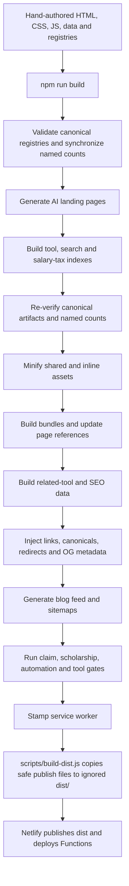

# AfroTools Architecture and Repository Contract

Last verified from the repository on 2026-07-11 at commit `18ce63a`.

This document describes the code that exists. It is not a description of the
marketing site or a promise that every planned integration is live. Use
`docs/TECHNICAL-RISK-REGISTER.md` for known architectural risks and
`AGENTS.md` for the day-to-day change contract.

## Executive Summary

AfroTools is a CommonJS, static-first HTML/CSS/JavaScript application with a
large committed generated layer. Most public routes are HTML files in the
repository. Browser scripts progressively add search, country context,
calculators, saves, live data, and AI routing. Netlify builds an ignored
`dist/` publish directory and serves Netlify Functions beside that static
artifact. Supabase provides account and data storage; Paystack provides the
current Pro checkout path; Anthropic is the only implemented model provider.

Measured facts from the verified baseline:

| Surface | Current value | Canonical owner |
| --- | ---: | --- |
| Tool registry rows | 3,263 | `assets/js/components/tool-registry.js` |
| Canonical published tool records | 3,259 | generated canonical registry after four explicit redirect aliases are excluded |
| Public live tool experiences | 2,606 | named `tools.live_experiences` selector, including `toolCount` expansion |
| Crawlable canonical English rows | 1,252 | `scripts/build-tool-directory.js` -> `data/tool-directory.json` |
| Unique AI router entries | 1,252 | `assets/js/ai/tool-manifest.js` derived from the directory |
| Tool categories | 32 | `AFRO_CATEGORIES` in the tool registry |
| African countries | 54 | `data/registry/countries.json` |
| Widget registry entries | 223 | `widgets/WIDGET-REGISTRY.js` |
| Published site locales | 5 | `data/registry/locale-manifest.json` (`ig`, component-only `pt`, and component-only `ar` remain planned) |
| Pro app routes | 20 | 10 control apps plus 10 daily OS apps in the two Pro registries |
| Netlify Functions files | 252 | `netlify/functions/`, including shared modules and scheduled functions |
| Tracked Supabase migration files | 60 | `supabase/migrations/` |

Do not collapse these numbers into one generic "tool count." Each measures a
different layer.

## Stack and Entry Points

| Layer | Implementation | Main entry points |
| --- | --- | --- |
| Public web | Static HTML, CSS, IIFE/global browser JavaScript, Web Components | `index.html`, `tools/**/index.html`, country folders, category folders |
| Shared UI | CSS tokens/design system plus custom elements | `assets/css/tokens.css`, `assets/css/design-system.css`, `assets/js/components/navbar.js`, `footer.js`, `country-selector.js` |
| Calculation logic | Browser-side pure or mostly pure functions | `assets/js/engines/`, selected `assets/js/lib/*-engine.js`, tool-local scripts |
| Generated data | JSON/JS indexes committed to Git | `data/tool-directory.json`, `data/search-index.json`, `data/salary-tax-index.json`, related-tool data, AI catalog packs |
| Server/API | Netlify Functions, CommonJS | `netlify/functions/*.js`; friendly `/api/**` routes in `netlify.toml` |
| Auth/data | Supabase Auth and Postgres REST/RPC | `netlify/functions/auth-session.js`, `api-profile.js`, `api-workspace.js`, migrations |
| Payments | Paystack checkout, webhook, billing status | `create-checkout.js`, `paystack-webhook.js`, `api-pro-billing.js` |
| AI | Deterministic browser router plus optional consented server model calls | `assets/js/ai/`, `ai-route-intent.js`, `ai-advisor.js`, `_shared/ai-provider.js` |
| Hosting | Netlify static publish plus Functions and schedules | `netlify.toml`, `scripts/build-dist.js`, `_redirects`, `_headers` |

There is no framework router and no server-side page rendering. A clean URL is
normally backed by an `index.html`, a `.html` file, or an explicit Netlify
redirect/rewrite.

## Public Route Families

- `/` is the main static document and AI-assisted discovery surface.
- `/tools/{slug}/` is the normal pan-African tool route. Some full apps add
  `app.html` or a clean `/app` canonical.
- `/{country-slug}/` is a country hub; country calculators commonly use
  `/{country-slug}/{tool-id}.html`.
- Category hubs include `/salary-tax/`, `/document-pdf/`, `/legal/`,
  `/trade/`, `/career/`, and the other keys in `AFRO_CATEGORIES`.
- `/fr/`, `/sw/`, `/ha/`, and `/yo/` contain localized pages. Their route
  shapes are not interchangeable; consult the language strategy docs.
- `/pro/`, `/dashboard/`, `/auth/`, and `/api/` are static shells enhanced by
  account/API scripts.
- `/widgets/` is the widget product page; `/widgets/iframe/**` contains
  generated, `noindex` embed documents.
- `/.netlify/functions/{name}` is the function origin. `netlify.toml` maps
  public `/api/**` aliases to those functions.

## Page and Build Generation Flow



`npm run build` is not a conventional compile-to-output-only step. It
post-processes committed HTML and generated files in place. A healthy clean
checkout must remain clean after `npm run build:deploy`; CI checks this with a
post-build Git diff.

Important generator families:

| Concern | Source/generator | Output |
| --- | --- | --- |
| Tool discovery | `tool-registry.js`, `build-tool-directory.js`, `build-search-index.js`, `build-salary-tax-index.js` | committed JSON indexes and directory HTML data |
| Canonical catalog and public counters | tool/widget/country/locale/plan owners, `scripts/build-canonical-registry.js` | canonical JSON, registry report, browser selector projection, generated country data, committed named HTML values |
| AI vertical pages | `data/ai/vertical-landing-pages.json`, `scripts/generate-ai-landing-pages.js` | `/ai/**/index.html` |
| Localization | English source HTML, `lang/*.json`, `lang/pages/**`, `scripts/build-i18n.js` | committed locale routes under `/fr`, `/sw`, `/ha`, `/yo` |
| Widgets | widget sources, lite specs, `widgets/build-widget-product.js` | registry, manifest, and iframe pages |
| Blog feed | committed blog articles and `scripts/generate-blog-feed.js` | `blog/feed.xml` |
| Routes/SEO | page canonicals, `_redirects`, canonical-alias utilities, sitemap generator | `_redirects`, sitemap set, injected metadata |
| Deploy artifact | repository public allow/deny policy in `scripts/build-dist.js` | ignored `dist/` |

Many domain-specific generators also exist for agriculture, energy, cars,
AfroKitchen, French/Swahili surfaces, and other bulk page families. Prefer the
family generator over editing generated pages individually.

## Registries and Data Flow

### Tools, categories, countries, and widgets

`assets/js/components/tool-registry.js` remains the browser discovery source,
but `scripts/lib/canonical-registry.js` is the build interface. It normalizes
every row into an explicit schema, applies the declared redirect-alias policy,
validates destinations and references, and exposes named semantic selectors.
Downstream generators should use this canonical interface instead of repeating
route normalization or count arithmetic.

`data/registry/countries.json` owns the 54-country identity, localized names,
flag, route, source jurisdiction, currency, region, tool types, and locale
coverage model. `assets/js/data/african-countries.js` is a generated browser
projection consumed by `country-selector.js`; the selector must not maintain a
second country array. Generated country pages carry country/formula/source/
currency metadata and are checked by `npm run country:check`. See
`docs/COUNTRY-IDENTITY-CONTRACT.md`.

`widgets/WIDGET-REGISTRY.js` is generated by
`widgets/build-widget-product.js` from existing core widgets, one explicit AI
addition, and `widgets/lite/widget-pack.js` specs. Canonical validation links
widgets back to tool routes where possible and validates every iframe/full-tool
destination.

### Public counters and claims

| Claim | Current source chain | Required validation |
| --- | --- | --- |
| Raw, canonical, localized, indexable, and expanded tools | named selectors generated from canonical tool records | `npm run registry:check`, `npm run test:registry` |
| Widgets and widget categories | named selectors generated from `WIDGET-REGISTRY.js` | `npm run widgets:build`, then `npm run registry:build` |
| Categories | canonical category records plus `tools.category.*.published` selectors | `npm run registry:check`, `npm run check-links` |
| Countries, jurisdictions, and currencies | `data/registry/countries.json`, page identity metadata, and named selectors | `npm run registry:check`, `npm run country:check`, `npm run test:country-identity` |
| Published site languages | locale policy and `languages.site_published` selector | `npm run registry:check`, `npm run build:i18n:validate`, `npm run validate:hreflang` |
| Tool feature availability | tool `status`, `phase`, routes, and metadata in `tool-registry.js` | `npm run audit`, workflow-specific verification |
| Pro feature availability | `pro-app-registry.js`, `pro-daily-os-registry.js`, route implementation | `npm run pro:verify`, targeted browser test |
| AI availability | `tool-manifest.js`, workflow modules, server provider environment and consent | `npm run test:ai`, relevant Playwright route |
| Pro subscription prices | `assets/js/lib/pro-plan.js`, normalized as `product:*` records | registry check plus checkout, webhook, and billing contract tests/review |
| API plans/limits | `netlify/functions/_shared/api-plans.js`, normalized as `api:*` records | registry check, API docs consistency, and gateway tests |
| Measurable public claims | `data/audits/public-claim-registry.json` | `npm run audit:public-claims` |

Public copy is not itself a source of truth. Registry-backed headline values
carry `data-registry-count` or `data-registry-plan` markers and are synchronized
at build time. `assets/js/data/registry-counts.js` gives client enhancement the
same selector values without delaying the initial HTML.

## Shared Layout and Design System

There is no single server template. Shared layout comes from:

- CSS tokens and primitives in `assets/css/tokens.css`, `global.css`,
  `design-system.css`, `calculator.css`, and the doctrine in
  `docs/design-doctrine.md`.
- Web Components and shared scripts in `assets/js/components/`, especially
  navbar, footer, breadcrumbs, country selector, tool search, related tools,
  save/export actions, consent, and source-state UI.
- Page-family scripts in `assets/js/pages/` and many inline page controllers.
- Build-time bundling and cache-busting in `scripts/bundle.js`,
  `update-html-bundles.js`, and `cachebust.js`.

Some committed `.js` sources are minified in place. Do not assume that a
non-`.min.js` filename is readable hand-authored source; inspect the generator
and Git history before editing it.

## Calculation Engines and High-Stakes Logic

Reusable calculation engines live in `assets/js/engines/` (PAYE, solar ROI,
remittance, Nigerian import duty, market days) and in selected `assets/js/lib/`
modules. Widget-only engines live under `widgets/engines/` or widget category
folders. Netlify has server-side tax engines under
`netlify/functions/_engines/`.

Formula changes require jurisdiction, source, effective-date, and disclaimer
evidence plus fixtures before implementation. Keep engines DOM-free where
possible. Validate the public browser engine and any corresponding API/server
engine; they are separate implementations and can drift.

## Localization Flow

The primary localization contract is:

1. `data/registry/locale-manifest.json` owns locale identity, launch status,
   formatting, market focus, fallback locale, and indexability thresholds.
2. `data/registry/locale-coverage-policy.json` owns route-family rules and exact
   fallback/deprecation decisions. `scripts/build-localization-platform.js`
   materializes every page into `data/registry/locale-page-coverage.json` and
   reports native, shell, fallback, unavailable, and deprecated counts.
3. English source HTML remains the behavioral base. Shared strings live in
   `lang/en.json`, `lang/fr.json`, `lang/sw.json`,
   `lang/yo.json`, and `lang/ha.json`.
4. Page-specific translations and optional body fragments live under
   `lang/pages/**`.
5. `scripts/build-i18n.js` generates or rebuilds eligible localized output,
   rewrites locale metadata and links, and injects equivalent-only hreflang.
6. French route-map helpers handle intentional slug differences. Swahili,
   Hausa, and Yoruba also have route-first/hand-authored areas documented in
   their strategy files.
7. `scripts/lib/route-contract.js` consumes page coverage before building
   equivalence groups. English fallbacks, unavailable pages, and deprecated
   routes are noindex and cannot enter hreflang or locale sitemaps.
8. `scripts/validate-hreflang.js` validates self references, reciprocals,
   canonicals, language codes, duplicates, and `x-default`.
9. `scripts/generate-sitemaps.js` creates locale sub-sitemaps and
   `sitemap-i18n.xml` from actual indexable files.

Public site locales are `en`, `fr`, `sw`, `yo`, and `ha`; `yo` and `ha` are
explicitly partial. `ig` is planned and is excluded from selectors, hreflang,
and sitemaps. AI routing accepts a different set of locale hints in some
contracts. Never infer public translation coverage from AI support: use the
manifest and generated page coverage record.

## Browser Hydration and Data Loading

Static HTML is the first render. Deferred scripts then:

- load the tool registry and dispatch `afrotools:registry-ready`;
- hydrate tool/category/country cards and dynamic counts;
- apply country and locale context;
- initialize calculator/page controllers;
- fetch live or cached data through `/api/**`;
- add favorites, workspace saves, analytics, AI assist, exports, and account
  state when those features are available.

The homepage remains useful without JavaScript. The verified `/all-tools/`
document does not: with JavaScript disabled it had one link and zero tool
cards. Data-heavy tools should show explicit loading, empty, error, stale, and
fallback states. The Scholarship Finder was verified at 390x844 with its API
forced to HTTP 503 and showed a clear refresh/fallback message without a
console error.

## Authentication, Dashboard, Vault, Favorites, and Sync

- `netlify/functions/auth-session.js` is the preferred auth boundary. It sets
  `HttpOnly`, `Secure`, `SameSite=Lax` access and refresh cookies and also
  accepts verified Bearer tokens for compatibility.
- Browser auth code is spread across `assets/js/afro-auth.js`,
  `supabase-auth.js`, `auth-cookie-upgrade.js`, `auth/index.html`, and dashboard
  inline controllers.
- `api-profile.js`, `api-favorites.js`, `api-history.js`, and
  `api-workspace.js` perform authenticated Supabase operations.
- `assets/js/lib/saved-tools.js` merges the local favorite cache with
  `/api/favorites`; `assets/js/favorites.js` is the simpler device API.
- `assets/js/lib/workspace-sync.js` provides the general local/account sync
  contract. Domain-specific sync helpers exist for PAYE, tax, seller, books,
  HR, documents, and other workflows.
- `/dashboard/`, `/dashboard/vault/`, `/pro/vault/`, and `/pro/workspace/`
  combine account-backed records with explicitly labeled device-local state.

Do not put new sensitive values in query strings, analytics, console output,
or unconsented network requests. Prefer local-first operation and explicit
user-triggered sync.

## AI Routing and Model Boundary

The default route is deterministic:

1. `assets/js/ai/tool-manifest.js` exposes known tools and routes.
2. `intent-router.js` ranks a local decision and validates provider-suggested
   decisions against the manifest.
3. `orchestrator.js` builds a workflow plan. Obvious intents remain local.
4. `prefill-adapters.js` stores private/long prefill data in short-lived
   `sessionStorage`, not in the URL.
5. Workflow modules add domain-specific clarification and safe exports.
6. `ai-route-intent.js` may call the provider only when provider configuration
   exists and model consent is present; deterministic fallback remains.
7. `ai-advisor.js` handles optional explanations/generation after consent and
   uses `_shared/ai-consent-guard.js` for sensitive payloads.
8. `_shared/ai-provider.js` implements Anthropic and returns structured failure
   reasons when disabled, unconfigured, rate-limited, or unavailable.

No additional provider is implemented. Model output must never create unknown
tool IDs, trusted routes, formulas, official claims, or unvalidated source
labels.

## Functions, APIs, and Database Topology

`netlify/functions/` contains public APIs, auth/account endpoints, payment
handlers, live-data adapters, scheduled jobs, creator/AfroStream functions,
and shared modules. `netlify.toml` owns public rewrites and 35 parsed scheduled
function declarations. `data/automation/automation-registry.json` and its audit script
track Netlify, GitHub, Codex, mixed, and manual automation ownership.

Repository migration history describes two Supabase projects:

- AUTH/account project: `zpclagtgczsygrgztlts`, used for profiles and newer
  identity/RLS-coupled Pro schemas.
- Retired legacy DATA project: `jbmhfpkzbgyeodsqhprx`, formerly used by early
  calculation, benchmark, FX, workflow, and vault migrations.

`supabase/migrations/053-single-project-consolidation.sql` completes the move to
the AUTH project. Deployable code, Netlify variables, and the repo-local
`supabase` MCP target must now use `zpclagtgczsygrgztlts`. The migration ledger
keeps the old instance mapping and migration 007 caveat as historical context.
Newer domains include car pricing,
scholarships, market data, AfroStream, AfroPayroll, AfroSeller, Matchday, email
automation, and draft next-generation Books/HR schemas. Repository files do
not prove that a migration is applied live. Inspect the correct project with
the configured Supabase MCP before SQL, schema, logs, policies, or generated
types work.

## Pro and Payments

`assets/js/lib/pro-app-registry.js` owns ten control apps and explicit readiness
labels. `pro-daily-os-registry.js` owns ten additional daily OS apps. Only
Payroll is labeled as the live account-backed workspace in the control
registry; other routes carry local, shell, review-packet, limited-preview, or
schema states.

`assets/js/lib/pro-plan.js` owns browser subscription price display for USD,
NGN, KES, ZAR, and GHS monthly/annual plans. API product limits are separate in
`netlify/functions/_shared/api-plans.js`. Paystack checkout begins in
`create-checkout.js`; `paystack-webhook.js` verifies signatures and updates
profiles; `api-pro-billing.js` reports status and currently routes cancellation
to manual review. Do not copy prices or feature availability into new pages
without reading these owners.

## Analytics, Logging, and Error Reporting

- `assets/js/lib/analytics.js` sends GA4 events only after cookie consent.
- `assets/js/lib/clarity.js` loads Microsoft Clarity only after the same consent.
- `assets/js/lib/error-boundary.js` shows browser error UI, logs to the console,
  and may emit a truncated GA4 error message.
- AI intent analytics are designed to keep metadata/length buckets instead of
  raw sensitive prompt content.
- Netlify Functions use platform `console` logs; scheduled-proof and automation
  records provide operational evidence for selected jobs.
- No repository-backed Sentry/Bugsnag/Rollbar-style error reporter was found.

Search analytics currently accept the first 100 characters of a search query.
Treat search fields as potentially sensitive and do not expand that payload.

## Canonicals, Redirects, Hreflang, and Sitemaps

- Page HTML owns the intended canonical.
- `scripts/lib/canonical-aliases.js` derives safe aliases from actual files and
  redirect-like compatibility pages.
- `scripts/fix-canonical-alias-links.js` rewrites internal links away from
  canonical aliases.
- `scripts/update-html-canonical-redirects.js` regenerates a marked block in
  `_redirects`; explicit business/API redirects also live in `_redirects` and
  `netlify.toml`.
- `scripts/build-seo-system.js`, `apply-og-fallbacks.js`, and
  `seo-daily-fix.js` enforce metadata.
- `scripts/generate-sitemaps.js` scans actual HTML, excludes `noindex`, redirect
  sources, canonical mismatches, internal directories, and unsupported
  surfaces, then writes the committed sitemap set.
- Hreflang is generated only for known equivalents and validated separately.

Never patch sitemap files first. Change the route, canonical, registry, or
generator source, then regenerate.

## Source Files Versus Generated Artifacts

| Classification | Examples | Git policy |
| --- | --- | --- |
| Hand-authored source | HTML pages, tool registry, engines, CSS, functions, migrations, `lang/**` | tracked; edit deliberately |
| Generator source | `scripts/**`, widget builder/specs, AI page definitions, route maps | tracked; preferred for bulk fixes |
| Committed generated/post-processed output | `/fr`, `/sw`, `/ha`, `/yo`, JSON indexes, bundles, minified files, related-tool data, feed, sitemaps, `_redirects`, service-worker stamp | tracked; regenerate from owner and include expected diff |
| Deploy artifact | `dist/` | ignored; always rebuild and audit |
| Evidence/local state | `artifacts/`, `audit-results/`, `test-results/`, `.netlify/`, `.playwright-cli/`, most transient reports | ignored or non-product; do not ship |

Verified tracked counts include 3,453 French files, 856 Swahili files, 108
Hausa files, 47 Yoruba files, 17 bundle files, 13 root sitemap files, and the
committed tool/search indexes. `dist/` has zero tracked files.

## Setup, Preview, Test, and Deploy Contract

Prerequisites are Node.js/npm and a browser installed for Playwright. The
repository uses `package-lock.json` and CommonJS.

```bash
npm ci
npm run lint
npm run type-check
npm test
npm run test:playwright:smoke
```

Local preview:

```bash
node tests/support/static-server.js  # http://127.0.0.1:4173
node _serve.js                       # http://localhost:3000
```

Release-equivalent repository gates:

```bash
npm run test:ai
npm run security:scan
npm run pro:verify
npm run localization:check
npm run test:localization
npm run build:i18n:validate
npm run validate:hreflang
npm run build:deploy
npm run audit:dist
git diff --exit-code
git diff --check
```

Netlify production, deploy-preview, branch-deploy, and staging contexts all run
`npm run build:deploy`. The production command also runs IndexNow as a
best-effort post-build action. Netlify publishes `dist/`, while Functions stay
outside the static publish directory.

## Verified Baseline

The 2026-07-11 pre-edit baseline passed lint, type-check, AI tests, broad tests,
security scan, Pro verification, i18n key validation, hreflang validation,
`build:deploy`, `audit:dist`, and the three-test Chromium automation smoke. The
pre-edit build left the tracked tree clean. A later same-session build crossed
the generator date boundary and restamped five committed outputs; those
out-of-scope artifacts were reversed after the deploy artifact passed audit.
The broad test suite emitted automation freshness warnings for several
Codex-owned schedules; see the risk register.
