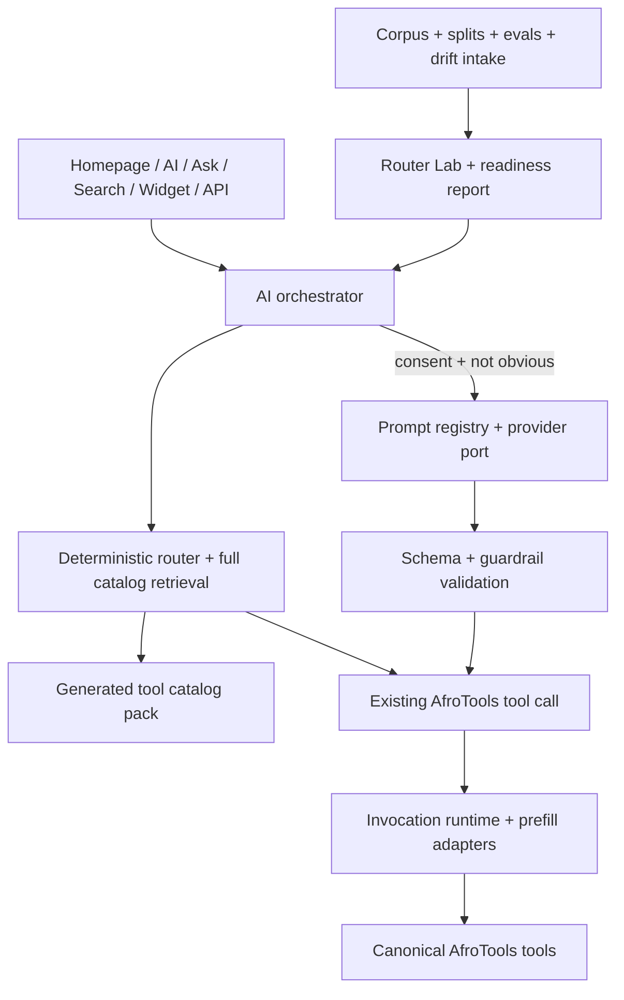

# AfroTools AI Product Architecture

Status: static-first AI orchestration. Do not add a heavy frontend framework unless a future requirement proves the current static module pattern cannot satisfy the workflow.

## Decision

AfroTools AI is a routing and orchestration layer over existing AfroTools tools. It should not become a giant generic chatbot or a separate SPA that replaces the calculator/document catalog.

Use:

- static HTML pages for surfaces such as `/`, `/ai/`, `/ask/`, `/search/`, widgets, and vertical AI pages;
- vanilla browser JavaScript modules under `assets/js/ai/`;
- generated JSON artifacts under `data/ai/`;
- Netlify functions only for provider ports, API routing, sync, or server-side policy checks.

Avoid by default:

- React, Next.js, Vue, Svelte, Angular, or a client-side app shell for core routing;
- hidden iframe experiences for the primary Ask AfroTools AI route;
- model-generated routes, formulas, source labels, or compliance claims.

Partner widgets can still be embedded as iframes, but those widgets are only
lightweight routing surfaces. Their AfroTools handoff links must open canonical
AfroTools routes in a new browsing context with `rel="noopener"` and must not
carry raw prompt text in the URL.

## Layers

The shared orchestration contract lives in `assets/js/ai/orchestrator.js`. It
builds an `afrotools_ai_orchestration_plan` from a query using the full catalog,
then exposes a sanitized public summary without raw prompt text.

The primary surfaces (`/ai/` and `/ask/`), the `/search/` discovery page, and the
embedded mini-router widget use that shared contract when the local catalog
assets are available, then fall back to smaller deterministic paths without
exposing raw prompts beyond the normal user-entered search query.

`/ask/` must remain a lightweight first screen for routing, refinement, and
handoff. It should show the selected existing tool, safe related tools when
confidence is strong enough, and actionable missing-detail chips that return
focus to the prompt instead of launching a generic chatbot or iframe shell.
Router feedback from this surface should feed aggregate drift signals without
storing raw prompt text. Prompt-submit and tool-open funnel events should use
metadata-only payloads such as query length, selected tool id, confidence, and
missing-input types.

## Gates

Run before promoting AI router, prompt, provider, manifest, or product-architecture changes:

- `npm run ai:tool-catalog-pack`
- `npm run ai:training-corpus`
- `npm run ai:model-splits`
- `npm run eval:ai-tool-calls`
- `npm run ai:ops-report`
- `npm run ai:architecture-report`
- `npm run test:ai`

The architecture report lives at `data/ai/ai-product-architecture-report.json` and checks that the product remains lightweight, static-first, full-catalog, and existing-tool-call driven.
