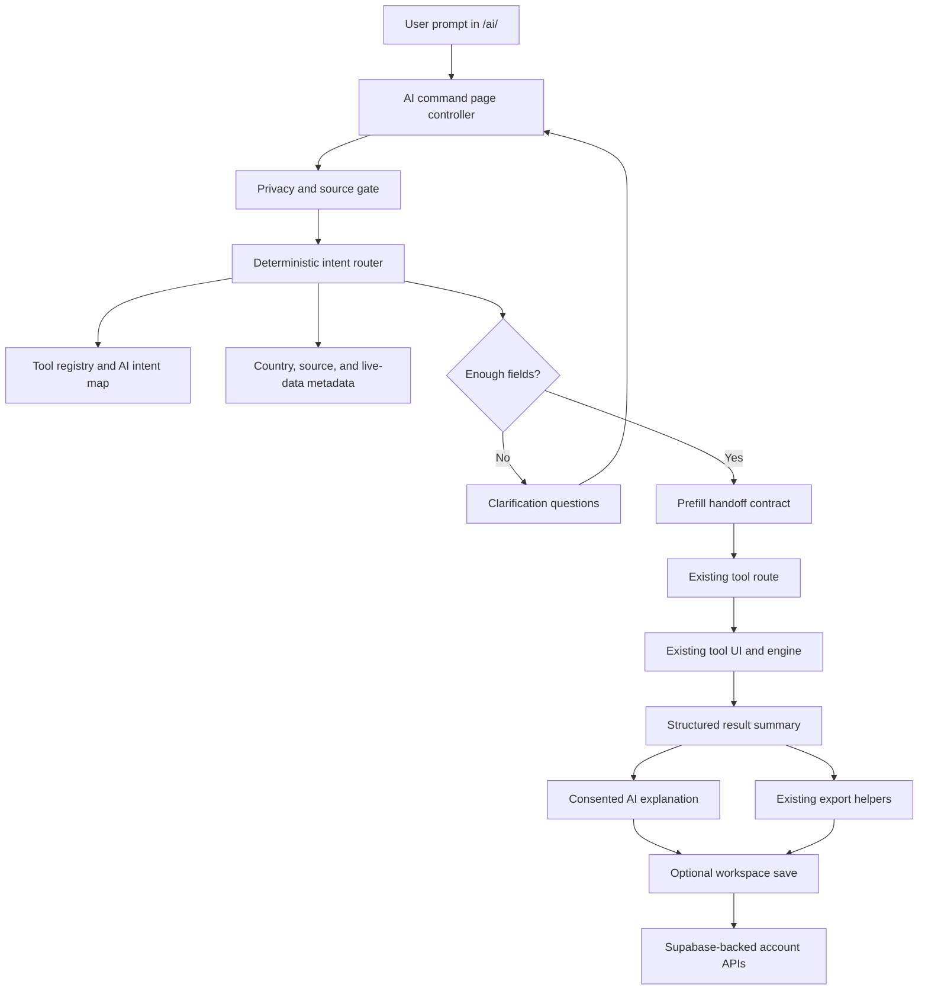

# AfroTools AI Transformation Map

Status: implementation map only. This document does not rename public routes, change SEO, add claims, or introduce a new AI provider.

Goal: turn AfroTools into "AfroTools AI - Africa's Practical AI Hub" by adding a central Ask AfroTools AI surface that routes prompts into existing tools, pre-fills forms, explains results, generates exports, and preserves the repo's local-first privacy and source-labeling patterns.

## Current Repo Shape

### Framework and Runtime

- Static-first HTML, CSS, and browser JavaScript, with no frontend framework build step.
- Browser modules mostly use IIFE/global APIs under `window.AfroTools.*`.
- Netlify is the deployment target. `netlify.toml` publishes `dist/`, serves `netlify/functions/`, and runs `npm run build:deploy` for production and deploy previews.
- `playwright.config.js` serves the site from `tests/support/static-server.js` on `http://127.0.0.1:4173`.
- `package.json` has no `npm run dev` or `npm run lint` script.

### Routing Structure

- Public pages live in root folders such as `salary-tax/`, `document-pdf/`, `education/`, `energy/`, `trade/`, `legal/`, `government/`, and country folders such as `nigeria/`, `kenya/`, and `ghana/`.
- Tool pages normally live at `tools/{tool-slug}/index.html`.
- App subroutes commonly use `tools/{tool-slug}/app.html` with canonical `/tools/{tool-slug}/app`.
- Pro routes live under `pro/`, including `pro/apps/`, `pro/workspace/`, `pro/vault/`, `pro/team/`, `pro/settings/`, and billing/success/cancel routes.
- Localized generated surfaces live under `fr/`, `sw/`, `ha/`, and `yo/`.
- Widgets live under `widgets/`, with generated iframe routes under `widgets/iframe/`.

### Major App Areas

- Free tools: `tools/**`, root category folders, and country folders.
- Pro apps: `pro/apps/**`, with Payroll currently the clearest active Pro app and other apps at mixed readiness.
- Engineering apps: `engineering/afrodraft/` and `engineering/floor-planner/`.
- AfroStream: `tools/afrostream/`, `afrostream/`, `assets/js/pages/afrostream*.js`, `engines/afrostream-engine.js`, and `netlify/functions/afrostream-*`.
- AfroAtlas: `tools/afroatlas/`, `assets/js/pages/afroatlas*.js`, and `engines/afroatlas-engine.js`.
- AfroKitchen: `tools/afrokitchen/`, `data/afrokitchen/`, and related API functions.

### Shared UI and Browser APIs

- Component layer: `assets/js/components/`.
- Important existing components for the AI pivot:
  - `tool-registry.js` for the public tool catalog.
  - `site-assistant.js` for the existing floating assistant.
  - `ai-consent.js` for user consent before sending AI-advisor content.
  - `tool-search.js`, `command-palette.js`, `country-selector.js`, `related-tools.js`, `business-cta.js`, `save-result-button.js`, `save-to-vault-button.js`, and `pdf-export.js`.
- Shared libraries: `assets/js/lib/`.
- Important shared libraries:
  - `analytics.js`
  - `api-cache.js`
  - `auth-gate.js`
  - `data-freshness.js`
  - `export-tools.js`
  - `live-data.js`
  - `pro-app-registry.js`
  - `sanitize.js`
  - `save-state*.js`
  - `seo.js`
  - `share-state.js`
  - `storage.js`
  - `workspace-sync.js`

### Data and Source Directories

- Core data roots: `data/`, `assets/js/data/`, and `engines/`.
- Important data folders:
  - `data/forex/`
  - `data/fuel/`
  - `data/rates/`
  - `data/scholarships/`
  - `data/trade/`
  - `data/energy/`
  - `data/government/`
  - `data/transport/`
  - `data/hr/`
  - `data/cars/`
  - `data/telecom/`
  - `data/insurance/`
  - `data/legal/`
  - `data/market-data`-style files documented in `docs/MARKET-DATA-INGESTION.md`.
- Source freshness metadata already exists in `data/_meta.json`.
- Country and route metadata appears in `assets/js/data/african-countries.js`, country pages, registry files, and generated indexes.

### Tool Metadata and Category Registries

- `assets/js/components/tool-registry.js` is the browser-facing registry and exposes `AFRO_TOOLS`.
- `data/tool-directory.json` is the generated/searchable directory. Current inspection found 1,248 entries across categories including financial, document-pdf, education, energy, trade, government, small-business, legal, career, engineering, transport, and travel.
- `data/search-index.json` and SEO/report scripts depend on registry consistency.
- Registry edits require route, link, search, and audit validation.

### API Routes and Functions

Netlify redirects expose functions through `/api/*`. Important route groups:

- AI and generation: `ai-advisor`, `ai-business-plan`, creator copy functions, crypto advisor, and PDF text-to-speech.
- Auth/account: `auth-session`, `api-profile`, `api-history`, `api-favorites`, `api-workspace`, `api-pro-billing`, `create-checkout`, `create-subscription`, and Paystack webhook handling.
- Live data: `api-forex`, `api-fuel`, `api-rates`, `api-tax`, `api-tax-rates`, `api-vat`, `api-commodity-prices`, `api-electricity`, `api-telecom`, `api-data-freshness`, `api-scraper-health`, and market-data ingestion functions.
- Scholarships: `api-scholarships`, `api-scholarship-saves`, `api-scholarship-reminders`, `api-scholarship-values`, and scheduled scholarship jobs.
- AfroStream: `afrostream-*` functions for creators, streams, live checks, news, snapshots, sync, admin, and community submissions.

### Auth and User Accounts

- Browser auth is handled by `assets/js/afro-auth.js`, `assets/js/supabase-auth.js`, and `assets/js/auth-cookie-upgrade.js`.
- Server cookie auth is handled by `netlify/functions/auth-session.js` and `_shared/browser-session-auth.js`.
- Workspace persistence is handled by `assets/js/lib/workspace-sync.js` and `netlify/functions/api-workspace.js`.
- The account-backed tables are represented in `supabase/migrations/` and docs. Live project truth still requires the configured AfroTools Supabase MCP before making live-schema or SQL claims.

### Analytics

- Shared analytics lives in `assets/js/lib/analytics.js`.
- The AI surface should log metadata only: intent id, selected tool id, country code, source freshness state, export type, consent state, and outcome band.
- It must not log raw prompts, CV/resume text, job descriptions, legal facts, health text, financial records, account IDs, emails, phone numbers, or generated sensitive document content.

### Tests and Validation

- Broad test command: `npm test`.
- Core route and registry checks: `npm run check-links`, `npm run audit`, `npm run tools:quality`, `npm run tools:quality:browser`.
- Build and release checks: `npm run build`, `npm run build:deploy`, `npm run audit:dist`, `npm run security:scan`.
- SEO checks: `npm run sitemap`, `npm run seo:report`, `npm run seo`, `npm run seo:og`, `npm run seo:widgets`, `npm run counts:sync`, `npm run inventory:site`.
- i18n checks: `npm run build:i18n:validate`, `npm run validate:hreflang`, `npm run build:i18n:full`.
- Workflow checks: `npm run document-pdf:verify`, `npm run pdf:verify`, `npm run pro:verify`, `npm run category-workflow:verify`, `npm run legal-workflow:verify`, `npm run salary-tax:verify`, `npm run vat-business-tax:verify`, `npm run test:privacy-ai-consent`.
- Source checks: `npm run government:sources:check`, `npm run transport:sources:check`, `npm run fuel:sources:check`, `npm run solar-roi:data:check`, `npm run scholarships:source-recon`.

## Existing AI and Assistant Surface

- `assets/js/components/site-assistant.js` already provides a floating assistant that can search the tool registry, suggest routes, and call `window.AfroTools.ai.ask` when available.
- `assets/js/components/ai-consent.js` intercepts AI-advisor calls and requires explicit user consent before sending prompt and calculation summary data.
- `netlify/functions/ai-advisor.js` is an existing Anthropic-backed server function with rate limiting and account-aware Pro behavior.
- `docs/ADDING-A-COUNTRY.md` already mentions AI advisor country context.
- `engineering/floor-planner/js/fp-ai.js` and `engineering/floor-planner/js/fp-ai-consent.js` show a tool-specific AI pattern.
- Several tools already use AI or advisor language in the registry and APIs, including business planning, PDF chat, CV/career workflows, creator tools, legal workflow guidance, and crypto guidance.

Important boundary: the current assistant is mostly navigational/advisory. The proposed Ask AfroTools AI surface should become a typed workflow router with privacy gates, prefill contracts, source labels, and export handoffs.

## Target Product Shape

Add a new central route without replacing existing public routes:

- Current command destination: `ai/index.html` with canonical `/ai/`.
- Earlier shell retained: `ask/index.html` with canonical `/ask/`.
- Optional later registry alias: `tools/ask-afrotools-ai/index.html` only if SEO and registry validation support it.
- Existing tool URLs remain canonical for tool-specific SEO.
- Ask AfroTools AI acts as an entry point, not a route migration.

The first version should work without a server AI call:

1. Parse prompt locally into a likely intent.
2. Ask clarifying questions for missing required fields.
3. Route to the best existing tool.
4. Pass prefill state through safe query parameters or local/session handoff.
5. Let the existing tool calculate.
6. Offer an AI explanation only after consent.
7. Offer export/save using existing export and workspace modules.

### Experimental Command Homepage Variant

Feature flag: `NEXT_PUBLIC_AFROTOOLS_AI_HOME_VARIANT=command`.

The homepage can opt into a chat-first command hero named `AfroToolsAICommandHero`. It is intentionally chat-first, not chat-only: the existing homepage route, SEO metadata, country discovery, tool/category links, flagship apps, APIs, widgets, and business sections remain available below the hero or in the unchanged default variant. The command hero should route prompts into existing workflows rather than replacing canonical tool pages.

Current submit route: `/ai/?q=<encoded query>`. The earlier `/ask/` shell remains available, but the homepage command variant should use `/ai/` as the routing destination.

Source confidence model: `docs/source-confidence-model.md` defines the shared `DataSourceMeta` schema, confidence levels, freshness policy, cautious claim rules, and migration checklist for data-backed workflow cards, calculators, and future AI explanations.

Local enablement for QA:

- Query flag: `/?ai_home_variant=command`
- Browser storage: `localStorage.setItem("NEXT_PUBLIC_AFROTOOLS_AI_HOME_VARIANT", "command")`
- Runtime config: `window.AFROTOOLS_FLAGS.NEXT_PUBLIC_AFROTOOLS_AI_HOME_VARIANT = "command"` before homepage boot

Metrics to track with metadata only:

- `ai_home_input_submit`: query presence, length, and selected command route
- `ai_home_example_click`: chip id and prompt length
- `ai_home_category_click`: category id and local href
- `ai_command_page_view`: query presence and length
- `ai_command_query_submit`: query presence and length
- `ai_command_tool_open`: selected tool id, route, and prefill availability
- `ai_command_fallback_used`: fallback reason and query length
- `ai_clarification_shown`: selected tool id, missing-field count, and routing source
- `ai_clarification_answered`: selected tool id, answered-field count, and remaining missing-field count
- `ai_prefill_payload_created`: selected tool id and missing-field count
- `ai_prefill_open_tool`: selected tool id, route, prefill support, and save outcome
- `ai_consent_requested`, `ai_consent_accepted`, `ai_consent_declined`: prompt presence and length only
- `ai_continue_without_ai`: selected tool id or fallback context
- Privacy-safe intent events:
  - `ai_intent_routed`: detected category, selected tool id, detected country bucket, missing input types, query length bucket, entry source, routing source, and confidence bucket.
  - `ai_intent_fallback`: fallback reason, selected fallback target, query length bucket, and entry source.
  - `ai_intent_tool_open`: selected tool id, prefill/open outcome metadata, fallback flag, query length bucket, and entry source.
  - `ai_intent_clarification_shown`, `ai_intent_clarification_answered`, `ai_intent_clarification_abandoned`: selected tool id, missing input types, source, and count/rate metadata.

Do not log raw prompts, CVs, document text, financial details, profile data, or other sensitive content from this surface.

Implementation notes:

- `assets/js/ai/intent-analytics.js` builds sanitized event payloads and stores local aggregate counters under `afrotools.aiIntentAnalytics.v1`.
- The homepage command variant passes a `source` query parameter into `/ai/`: `homepage_input` for typed submissions and `prompt_chip` when a prompt chip populated the query. `/ai/` also understands `direct_ai`, `category_pill`, and `search_fallback` for future entry points.
- Query text is never included in analytics payloads by default. The payload uses `query_length_bucket` such as `1-20`, `21-60`, `61-140`, `141-280`, or `281+`.
- Raw query logging is only allowed when `NEXT_PUBLIC_AFROTOOLS_AI_RAW_QUERY_LOGGING` is explicitly enabled through runtime flags or local development storage. This is for controlled debugging only and should stay off in production because prompts may contain personal, career, document, financial, legal, or education-profile details.
- Local debug mode is available with `/ai/?ai_debug=intent` or `localStorage.setItem("afrotools.aiIntentDebug", "intent")`. It renders parsed state in the browser without sending raw query text from the debug panel.
- Local aggregate reporting is available at `/ai/intent-report.html`. The report is `noindex,nofollow`, reads only the current browser's aggregate counters, and summarizes top routed categories, top countries detected, top missing inputs, fallback rate, tool open rate, clarification completion rate, selected tools, query length buckets, and source breakdown.

### Current `/ai/` Workflow Launcher

The `/ai/` command page now keeps a structured workflow state with the original query, selected tool id and route, confidence, extracted inputs, clarification answers, a short-lived prefill payload, consent state, and routing source (`router`, `deterministic`, or `fallback`). The command flow is:

1. Read `/ai/?q=<encoded query>` into the editable command input.
2. Try the intent router endpoint with `consentToModel:false`; if it is disabled or fails, use deterministic keyword routing.
3. Render workflow cards rather than chat bubbles.
4. Ask for missing inputs with compact clarification controls when the selected tool has gaps.
5. Build a safe prefill launch payload and open the existing canonical tool route.

- Initial routing calls `/.netlify/functions/ai-route-intent` with `consentToModel:false`.
- A compact consent card lets users explicitly retry with model/provider routing; that is the only `/ai/` path that sets `consentToModel:true`.
- Clarification forms ask up to three practical fields at a time, using selects, short inputs, and chips rather than chat bubbles. Users can skip and open the tool manually or browse instead.
- The page uses `assets/js/ai/prefill-adapters.js` to build safe launch payloads and writes them to `sessionStorage` under the existing `afrotools.aiPrefillDraft` key.
- URLs carry only `source=ask&prefill=1`; sensitive values such as salaries, CIF values, invoice amounts, client names, and profile details stay out of query strings.
- Public helper surface: `window.AfroToolsAICommandPage.getState()`, `buildToolPrefillUrl()`, `saveToolPrefillPayload()`, and `readToolPrefillPayload()`.
- Intent analytics helper surface: `window.AfroToolsAIIntentAnalytics.buildPayload()`, `record()`, `getReport()`, `reset()`, and `queryLengthBucket()`.
- Destination pages use `assets/js/ai/prefill-consumer.js` from the core bundle. They show a "Started from AfroTools AI" notice, prefill only matching editable fields, and never auto-submit calculations, exports, applications, or saves.
- Consent remains opt-in. Deterministic routing and manual tool launch work without model consent, and the optional AI retry explains that the current prompt may be sent to AfroTools servers and a configured model provider.

Pilot clarification coverage: CV Builder, Scholarship Finder, Study Abroad Planner, Import Duty, Solar/Fuel, PAYE, Invoice Generator, and PDF Workspace.

Supported first prefill receivers:

- CV Builder: receives target role, country/market, location hint, and explicit skills when present through `window.CVApp`; full CV text stays local unless a separate AI action asks for consent.
- Scholarship Finder: receives study level, field, destination, GPA/score, and filter/profile controls where fields exist. Nationality/home country is retained in the notice summary because the current finder has no dedicated nationality field.
- Import Duty Calculator: receives general goods or car import values, destination, item/vehicle, purchase/CIF value, shipping cost, year, make/model when catalog options are available, and engine size. It leaves calculation to a user click.

Known limitations in the current `/ai/` shell:

- Clarification is rule-based and limited to the first three missing inputs per workflow.
- Prefill support is strongest for CV Builder, Scholarship Finder, and Import Duty; other pilot adapters may route only or partially fill stable fields.
- The command page still has inline controller code. Extract it later only when a second command surface needs the same behavior.
- Provider/model quality depends on the existing router function and environment configuration; deterministic routing must remain the dependable baseline.
- Session handoff expires quickly and is browser-tab scoped, so a copied `prefill=1` URL alone cannot recreate private payload values.
- The intent report is a local/dev aggregate view, not an authenticated production analytics dashboard. Server-side or warehouse reporting should use the same privacy-safe payload contract and must not collect raw prompts unless the explicit raw-query flag and privacy review are in place.

## Future AI Layers

### Data Layer

The AI surface should read and normalize existing repo data rather than creating a second product catalog.

| Data family | Current sources | AI use |
| --- | --- | --- |
| Tool catalog | `assets/js/components/tool-registry.js`, `data/tool-directory.json`, `data/search-index.json` | Intent candidates, route selection, supported export list, category fallback |
| Country catalog | `assets/js/data/african-countries.js`, country folders, country-specific engines | Country clarification, currency hints, country-specific tool routing |
| Source metadata | `data/_meta.json`, `data/government/`, `data/transport/`, `data/scholarships/`, `data/fuel/`, `data/rates/` | Source labels, freshness warnings, official/cached/fallback states |
| Tax and payroll | `assets/js/engines/*-paye.js`, `engines/*paye*`, `data/hr/`, salary-tax routes | PAYE routing, explanation, export summaries |
| FX and rates | `data/forex/latest.json`, `data/rates/latest.json`, `/api/forex`, `/api/rates` | Currency assumptions, freshness badges, rate-sensitive explanations |
| Fuel and energy | `data/fuel/latest.json`, `data/energy/`, `engines/fuel-engine.js`, `engines/solar-*` | Solar/fuel intent routing, stale-data warnings |
| Scholarships | `docs/SCHOLARSHIP-PIPELINE.md`, `data/scholarships/`, scholarship APIs | Eligibility matching, deadline/source caveats, save/reminder handoff |
| Trade/import | `data/trade/`, `assets/js/engines/import-duty-nigeria-engine.js`, `engines/car-import-*` | Duty prefill, route-to-tool, result explanation |
| Business rules | `engines/`, `assets/js/engines/`, `data/hr/`, Pro app registries | Deterministic calculations before AI explanation |
| Workspace/account | `assets/js/lib/workspace-sync.js`, `/api/workspace`, Supabase migrations | Optional signed-in save after user action |

### AI Reasoning Layer

The reasoning layer should be small, deterministic first, and compatible with the repo's browser-global style.

Proposed source files:

- `data/ai/tool-intents.json`
  - Maps user intent phrases to existing tool ids and categories.
  - Generated or reviewed from `AFRO_TOOLS`, not hand-maintained in isolation.
- `data/ai/tool-prefill-contracts.json`
  - Defines required fields, optional fields, supported countries, privacy class, and handoff type per pilot tool.
- `assets/js/ai/intent-router.js`
  - Browser IIFE module exposed as `window.AfroToolsAIIntentRouter`.
  - Performs local keyword/entity matching and returns ranked candidates.
- `assets/js/ai/clarification.js`
  - Builds missing-field questions from the prefill contracts.
- `assets/js/ai/prefill-handoff.js`
  - Writes safe handoff state to `sessionStorage` and emits shallow query parameters only when non-sensitive.
- `assets/js/ai/result-explainer.js`
  - Wraps existing `ai-consent.js` and `ai-advisor` behavior.
  - Sends only structured calculation summaries, not raw sensitive input.
- `assets/js/ai/export-planner.js`
  - Maps result objects to existing PDF/DOC/TXT/JSON/export helpers.
- `assets/js/pages/ask-afrotools-ai.js`
  - Optional page controller for `/ai/` or `/ask/` if inline page scripts are later extracted.
- `netlify/functions/_shared/ai-tool-context.js`
  - Optional extraction of the large static tool context from `ai-advisor.js` if the function needs cleanup.

Do not add a new AI package or provider for the first release. Reuse `netlify/functions/ai-advisor.js` for consented explanations and keep deterministic routing client-side.

### App Layer

| App family | Existing anchors | First AI behavior | Privacy/source boundary |
| --- | --- | --- | --- |
| CV and cover letters | `tools/cv-builder/`, `tools/cover-letter-generator/`, career tools | Route prompt to CV, cover letter, ATS, or job matching flow; prefill non-sensitive role/country fields only | Raw CV/JD text stays local unless explicit AI consent shows what will be sent |
| Scholarships | `tools/scholarship-finder/`, scholarship APIs, `docs/SCHOLARSHIP-PIPELINE.md` | Ask eligibility questions, route to finder, save/reminder handoff | Label live/cached/curated/fallback source mode |
| Study abroad | `tools/study-abroad-cost/`, education routes | Country/course/budget clarification, route to cost calculator | Mark estimates and data freshness |
| Import duty | `tools/import-duty/`, `data/trade/`, import-duty engines | Prefill origin/destination/value/category where safe | Show tariff/source confidence and no filing/compliance claim |
| Solar and fuel | `tools/solar-roi/`, fuel routes, energy data, fuel APIs | Route to solar ROI, generator fuel, diesel-vs-solar, or fuel tracker | Display stale-data and source labels from metadata |
| Invoice and business docs | invoice/receipt/business-plan routes, export helpers | Convert prompt into invoice or plan draft inputs | Avoid unsupported tax/legal claims; exports local first |
| PAYE and payroll | country PAYE tools, `assets/js/engines/*-paye.js`, `pro/apps/payroll/` | Ask country, gross pay, period, pension assumptions; route to public PAYE first | Do not gate free PAYE math behind Pro; no filing/payment claim |
| Floor planner | `engineering/floor-planner/` | Route room-size prompts into floor planner draft and explain layout assumptions | Keep AI-specific consent separate from local layout editing |
| AfroAtlas | `tools/afroatlas/`, `engines/afroatlas-engine.js` | Route country/comparison prompts into atlas views | Use source labels for country/business data |
| AfroStream | `tools/afrostream/`, `engines/afrostream-engine.js`, `netlify/functions/afrostream-*` | Route creator discovery, stream/news prompts, and media kit tasks | Keep live Supabase-backed freshness separate from static fallback claims |

## Data Flow



## Folder and Module Architecture

Keep the architecture static-first and repo-native:

```text
ask/
  index.html

assets/js/ai/
  intent-analytics.js
  intent-router.js
  clarification.js
  prefill-handoff.js
  result-explainer.js
  export-planner.js

assets/js/pages/
  ask-afrotools-ai.js

data/ai/
  tool-intents.json
  tool-prefill-contracts.json
  source-label-rules.json

netlify/functions/_shared/
  ai-tool-context.js
  ai-privacy-policy.js

tests/
  ai-intent-router.test.js
  ai-prefill-contracts.test.js

tests/e2e/
  ask-afrotools-ai.spec.js
```

Design rules:

- Keep calculation logic in existing engines.
- Keep Ask AfroTools AI as orchestration, not a replacement calculator.
- Prefer `sessionStorage` for prefill handoff; use query params only for non-sensitive small values like country, tool id, and currency.
- Use source metadata already in `data/_meta.json` and source-ledger directories.
- Use existing export helpers before adding new export code.
- Use `ai-consent.js` before any network call that sends user-entered sensitive content.
- Keep Pro and account features optional. Do not move free calculator value behind auth.

## Smallest 10 PRs

1. Documentation and contracts
   - Add this transformation map.
   - Add a draft schema for tool intents and prefill contracts.
   - No runtime behavior.

2. AI intent inventory
   - Generate or hand-curate `data/ai/tool-intents.json` from the current registry.
   - Cover top categories: salary-tax, education, trade, energy, document-pdf, career, business, AfroStream, AfroAtlas.
   - Add a contract validation test.

3. Deterministic intent router
   - Add `assets/js/ai/intent-router.js`.
   - Unit test ranking, country hints, category fallback, and unknown-intent behavior.
   - No AI provider call.

4. Central `/ai/` route
   - Add a static Ask AfroTools AI page using existing design-system CSS and shared navbar/footer.
   - Provide prompt input, candidate tools, and clarifying questions.
   - Log analytics metadata only.

5. Prefill handoff foundation
   - Add `prefill-handoff.js`.
   - Pilot safe handoff for PAYE, import duty, scholarship finder, study abroad cost, solar ROI, fuel, and invoice flows.
   - Prefer session storage for sensitive or long values.

6. Source-label and freshness integration
   - Add source-label rules that read from `data/_meta.json` and existing source ledgers.
   - Show official/cached/fallback/stale labels before result explanation.
   - Add tests for stale fuel/rates/forex scenarios.

7. Consented result explanations
   - Add `result-explainer.js` on top of existing `ai-consent.js` and `ai-advisor`.
   - Send structured summaries only.
   - Extend privacy tests so sensitive text is not logged or sent without consent.

8. Export planner
   - Add `export-planner.js` to map routed results into existing PDF/DOC/TXT/JSON helpers.
   - Pilot exports for PAYE, invoice, scholarships shortlist, import-duty estimate, and solar ROI.

9. Workspace save handoff
   - Add optional signed-in saves through `window.AfroWorkspace`.
   - Store result metadata and user-approved summaries, not raw sensitive prompts by default.
   - Keep local export available for signed-out users.

10. Public rollout and validation
   - Add nav/search/registry entry for `/ai/` without replacing existing tool routes.
   - Run route, SEO, privacy, registry, browser, and deploy-artifact validation.
   - Add release notes that describe Ask AfroTools AI as an assistant/router, not a legal, tax, medical, immigration, or filing authority.

## First 30 Days Checklist

### Days 1-7: Inventory and Safety

- Confirm the current dirty checkout and branch plan before implementation.
- Review `assets/js/components/tool-registry.js`, `data/tool-directory.json`, `data/_meta.json`, top engines, and top source ledgers.
- Draft `data/ai/tool-intents.json` and `data/ai/tool-prefill-contracts.json`.
- Mark every pilot intent with a privacy class: public, personal, sensitive-career, sensitive-financial, sensitive-legal, sensitive-health, or account-backed.
- Define analytics metadata fields and forbidden payload fields.
- Add validation tests for contracts.

### Days 8-14: Local Router and Ask Page

- Build the deterministic intent router.
- Add `/ai/` with accessible labels, keyboard flow, live status, and mobile-safe layout.
- Show ranked tool matches and clarification questions.
- Add prefill handoff for 3 low-risk pilots: PAYE, import duty, and solar ROI.
- Run route, registry, and targeted browser checks.

### Days 15-21: Source Labels, Explanations, Exports

- Wire source freshness labels for fuel, rates, forex, scholarships, and trade data.
- Add consented result explanation using existing AI advisor infrastructure.
- Add export planner integration for public non-sensitive summaries.
- Extend `test:privacy-ai-consent` coverage for the central Ask surface.
- Add workspace save only after explicit user action.

### Days 22-30: App Pilots and Release Hardening

- Expand pilots to CV, scholarships, study abroad, invoice, floor planner, AfroAtlas, and AfroStream.
- Add E2E coverage for prompt-to-tool routing and prefill.
- Validate mobile layout and console cleanliness.
- Run `npm run check-links`, `npm run audit`, `npm run tools:quality`, `npm run test:privacy-ai-consent`, and targeted workflow checks.
- For release, run `npm run build:deploy`, `npm run audit:dist`, and `npm run security:scan`.

## Risks

- Sensitive content leakage: CVs, job descriptions, legal facts, health text, identity data, financial details, and account data must not be logged or sent without explicit consent.
- Unsupported claims: the AI layer must not imply official filing, legal advice, immigration advice, medical advice, guaranteed scholarships, or verified live rates unless the backing implementation and source validation exist.
- Source freshness drift: data such as fuel, FX, tax, rates, scholarships, and live creator data can go stale. The AI surface must expose freshness labels.
- Registry drift: a separate AI catalog can become inconsistent with `AFRO_TOOLS` and `data/tool-directory.json`.
- SEO confusion: `/ai/` and `/ask/` must not replace established tool canonicals or create duplicate tool pages.
- Prompt injection: user-entered documents and web-derived text should be treated as data, not instructions.
- Cost and abuse: existing `ai-advisor` rate limits should remain in force for AI explanations.
- Auth split: browser token auth, cookie auth, and workspace APIs must stay aligned.
- Generated-output churn: avoid hand-editing generated localized or dist files.
- Current checkout churn: many files are already dirty, so implementation PRs need narrow diffs and explicit ownership.

## Missing Repo Context

- Live Supabase schema, logs, and row-level policy state were not inspected because this task only required a repo documentation artifact. Use the configured AfroTools Supabase MCP before any live-schema, SQL, auth, or production-data change.
- Production environment variables, Anthropic usage limits, and Netlify deploy health were not verified.
- Current production route behavior was not browser-tested for this documentation-only pass.
- Some active dirty files may represent unreleased work and should be rechecked before implementation.
- The exact long-term brand migration plan from "AfroTools" to "AfroTools AI" is a product decision; this map assumes an additive `/ai/` launch while preserving existing routes.

## Validation Commands Discovered

Use the narrowest command that matches the touched surface:

```bash
npm run check-links
npm run audit
npm run tools:quality
npm run tools:quality:browser
npm run test:privacy-ai-consent
npm run document-pdf:verify
npm run pdf:verify
npm run pro:verify
npm run category-workflow:verify
npm run legal-workflow:verify
npm run salary-tax:verify
npm run vat-business-tax:verify
npm run government:sources:check
npm run transport:sources:check
npm run fuel:sources:check
npm run solar-roi:data:check
npm run scholarships:source-recon
npm run seo:report
npm run build:deploy
npm run audit:dist
npm run security:scan
npm test
git diff --check
```

For the first implementation PRs, start with contract/unit tests and one browser route test before running broad release checks.
